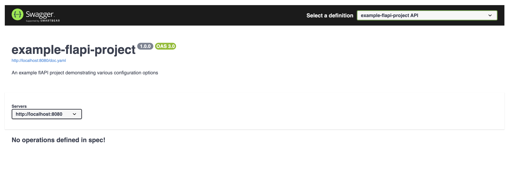

The document describes the issues encountered while setting up the docker-compose-bigquery environment.

## Issue 1: bigquery extension fails to load sometimes

The error message in the logs is:
```
docker-compose-bigquery-flapi-1  | (2024-10-30 11:26:51) [INFO    ] Loading configuration file: "/app/examples/flapi.yaml"
docker-compose-bigquery-flapi-1  | (2024-10-30 11:26:51) [INFO    ] Parsing main configuration
docker-compose-bigquery-flapi-1  | (2024-10-30 11:26:51) [INFO    ] Parsing connections
docker-compose-bigquery-flapi-1  | (2024-10-30 11:26:51) [INFO    ] Parsed 2 connections
docker-compose-bigquery-flapi-1  | (2024-10-30 11:26:51) [INFO    ] Parsing rate limit configuration
docker-compose-bigquery-flapi-1  | (2024-10-30 11:26:51) [INFO    ] Parsing auth configuration
docker-compose-bigquery-flapi-1  | (2024-10-30 11:26:51) [INFO    ] Parsing DuckDB configuration
docker-compose-bigquery-flapi-1  | (2024-10-30 11:26:51) [INFO    ] Parsing template configuration
docker-compose-bigquery-flapi-1  | (2024-10-30 11:26:51) [INFO    ] Parsing global heartbeat configuration
docker-compose-bigquery-flapi-1  | (2024-10-30 11:26:51) [INFO    ] Loading endpoint configs recursively from: "/app/examples/sqls"
docker-compose-bigquery-flapi-1  | (2024-10-30 11:26:51) [INFO    ] Loaded 2 endpoint configurations
docker-compose-bigquery-flapi-1  | (2024-10-30 11:26:51) [INFO    ] Configuration loaded successfully
docker-compose-bigquery-flapi-1  | terminate called after throwing an instance of 'std::runtime_error'
docker-compose-bigquery-flapi-1  |   what():  Error creating database, Details: Failed to execute init statement INSTALL 'bigquery' FROM 'http://storage.googleapis.com/hafenkran';
docker-compose-bigquery-flapi-1  | LOAD 'bigquery';
docker-compose-bigquery-flapi-1  | 
docker-compose-bigquery-flapi-1  |  Error: IO Error: Failed to download extension "bigquery" at URL "http://storage.googleapis.com/hafenkran/v1.1.2/linux_amd64/bigquery.duckdb_extension.gz"
docker-compose-bigquery-flapi-1  | 
docker-compose-bigquery-flapi-1  | Candidate extensions: "icu", "iceberg", "parquet", "inet", "azure" (ERROR Failed to read connection)
docker-compose-bigquery-flapi-1  | 
docker-compose-bigquery-flapi-1 exited with code 139
```

## Issue 2: With no erros or warnings, the container fails with error code 139.

The error message in the logs is:
```
docker-compose-bigquery-flapi-1  | (2024-10-30 11:28:45) [INFO    ] Loading configuration file: "/app/examples/flapi.yaml"
docker-compose-bigquery-flapi-1  | (2024-10-30 11:28:46) [INFO    ] Parsing main configuration
docker-compose-bigquery-flapi-1  | (2024-10-30 11:28:46) [INFO    ] Parsing connections
docker-compose-bigquery-flapi-1  | (2024-10-30 11:28:46) [INFO    ] Parsed 2 connections
docker-compose-bigquery-flapi-1  | (2024-10-30 11:28:46) [INFO    ] Parsing rate limit configuration
docker-compose-bigquery-flapi-1  | (2024-10-30 11:28:46) [INFO    ] Parsing auth configuration
docker-compose-bigquery-flapi-1  | (2024-10-30 11:28:46) [INFO    ] Parsing DuckDB configuration
docker-compose-bigquery-flapi-1  | (2024-10-30 11:28:46) [INFO    ] Parsing template configuration
docker-compose-bigquery-flapi-1  | (2024-10-30 11:28:46) [INFO    ] Parsing global heartbeat configuration
docker-compose-bigquery-flapi-1  | (2024-10-30 11:28:46) [INFO    ] Loading endpoint configs recursively from: "/app/examples/sqls"
docker-compose-bigquery-flapi-1  | (2024-10-30 11:28:46) [INFO    ] Loaded 2 endpoint configurations
docker-compose-bigquery-flapi-1  | (2024-10-30 11:28:46) [INFO    ] Configuration loaded successfully
docker-compose-bigquery-flapi-1  | (2024-10-30 11:28:46) [INFO    ] Warming up endpoint caches, this might take some time...
docker-compose-bigquery-flapi-1  | (2024-10-30 11:28:46) [INFO    ] Checking if cache should be refreshed for endpoint: /publicis
docker-compose-bigquery-flapi-1  | (2024-10-30 11:28:46) [INFO    ] Cache is fresh: publicis_cache_1730287651: (table age) 75s <= 300s (refreshTime from config)
docker-compose-bigquery-flapi-1  | (2024-10-30 11:28:46) [INFO    ] Finished warming up endpoint caches! Let's go!
docker-compose-bigquery-flapi-1  | (2024-10-30 11:28:46) [INFO    ] Setting up routes...
docker-compose-bigquery-flapi-1  | (2024-10-30 11:28:46) [INFO    ] Routes set up completed
docker-compose-bigquery-flapi-1  | (2024-10-30 11:28:46) [INFO    ] APIServer initialized
docker-compose-bigquery-flapi-1  | (2024-10-30 11:28:46) [INFO    ] Server starting on port 8080...
docker-compose-bigquery-flapi-1  | (2024-10-30 11:28:46) [INFO    ] flAPI server is running at http://0.0.0.0:8080 using 4 threads
docker-compose-bigquery-flapi-1  | 
docker-compose-bigquery-flapi-1  | (2024-10-30 11:28:46) [INFO    ] Call `app.loglevel(crow::LogLevel::Warning)` to hide Info level logs.
docker-compose-bigquery-flapi-1  | 
docker-compose-bigquery-flapi-1 exited with code 132
```

## Issue 3: Swagger UI does not show api specs

