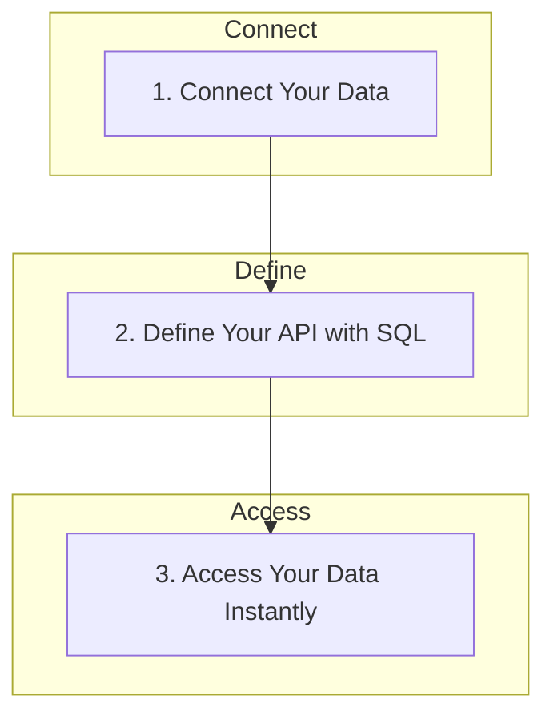

# flAPI: The High-Performance Serving Layer for Enterprise Data

**flAPI** acts as a powerful middleware that transforms your existing enterprise data systems—like Snowflake, BigQuery, or SAP—into fast, secure, and AI-ready APIs. It decouples your slow, expensive backend systems from the high-throughput demands of modern applications and AI agents, using the power of the DuckDB ecosystem for unparalleled performance and cost-efficiency.

---

## Core Value Proposition

flAPI simplifies the process of creating data APIs into three straightforward steps. This process effectively decouples high-throughput API consumers (like AI agents or web services) from traditional backend data systems, which are often not designed for low-latency, interactive query loads. The result is significantly improved performance and lower operational costs.



1.  **Connect Your Data:** Point flAPI to your data sources, whether they are local files (Parquet, CSV), or cloud data warehouses (BigQuery, Postgres).
2.  **Define Your API with SQL:** Write standard SQL queries and define your API endpoints using simple YAML configuration files. Use Mustache syntax to create dynamic and parameterized queries.
3.  **Access Your Data Instantly:** Run the flAPI server and immediately access your data through a secure, documented, and performant RESTful API.

---

## Key Features

flAPI is packed with features designed to make your life easier and your data more accessible.

### 1. Instant API Generation

Go from a SQL query to a fully functional REST API in minutes. flAPI handles all the boilerplate, including request validation, data serialization, and error handling, so you can focus on your data.

*   **Declarative Configuration:** Define your endpoints, parameters, and security rules in simple YAML files.
*   **SQL as a Transformation Layer:** Don't just query—transform. Use the full power of SQL to massage, reshape, and prepare your data for any application. flAPI makes it simple to perform significant transformations from source to target, right in the template.
*   **Dynamic SQL Templates:** Use Mustache syntax to create flexible and reusable SQL queries. The templating approach, inspired by dbt, is immediately familiar to data analysts and data scientists.
*   **Automatic Documentation:** flAPI automatically generates OpenAPI (Swagger) documentation for your APIs, making them easy to discover and use.

### 2. Local-First Development and Joyful Debugging

Embracing the "small data" philosophy, flAPI is designed for a delightful and efficient developer experience. Modern hardware is a beast, and flAPI lets you harness its full power on your local machine, avoiding unnecessary cloud complexity.

*   **Small Footprint, Huge Impact:** flAPI is a lightweight, single binary that starts in milliseconds. Develop locally with the exact same software you ship to production.
*   **Powerful Developer Tooling (CLI & VS Code):** The developer experience is supercharged with a dedicated CLI (`flapii`) and a VS Code extension. Validate configurations, test templates, manage the cache, and inspect endpoints directly from your terminal or editor. This integrated tooling provides an unmatched, introspective workflow that makes debugging fast and intuitive.
*    **Declarative and Introspective:** With simple YAML definitions and powerful VSCode tooling, you can see your entire API surface at a glance. This makes debugging intuitive and fast—no   │
 │       more digging through layers of abstraction to find a bug.   
*   **Think Small, Ship Joyfully:** The entire workflow is optimized for rapid iteration. Define your API, run `flapi`, and test it instantly. This tight feedback loop ends the "cloud hangover" and makes development a joy.
*   **Optimized for Serverless:** The same small footprint and millisecond startup time make flAPI perfect for cost-efficient serverless deployments. Easily deploy to platforms like AWS Lambda, Google Cloud Run, or Vercel for a highly scalable, pay-per-use production environment.

### 3. Decouple and Accelerate with a High-Performance Serving Layer

Traditional data warehouses (like Snowflake, BigQuery) and ERPs (like SAP) are not built for the low-latency, high-concurrency query patterns of AI agents and interactive applications. Querying them directly is slow and expensive. flAPI solves this by acting as a high-performance serving layer.

*   **From Big Data to Small Data:** flAPI's advanced caching uses DuckDB to materialize a fast, local "small data" slice from your larger, slower data sources. This is perfect for the high-value, recent data that most applications and AI agents need, making "big data" feel small and fast.
*   **Absorb and Protect:** The in-process cache absorbs the high-frequency query load from your applications, providing millisecond-level responses while protecting your backend systems and dramatically reducing costs.
*   **Built-in Security:** Secure your data at the edge with fine-grained authentication (Basic, JWT), authorization, and rate-limiting. Enforce access policies without adding load to your source systems.

### 4. Built for the AI-Native Enterprise

flAPI is designed to be a core component of the modern, AI-native data stack. AI agents require fast, frequent, and cost-effective access to enterprise data to function effectively. flAPI's ability to decouple agents from slow backend systems is the key to building responsive and scalable AI applications.

*   **Model Context Protocol (MCP) Support:** Automatically expose your SQL templates as tools for AI agents and models, enabling them to interact with your data in a structured and secure way.
*   **Unified Configuration:** Define your REST endpoints and MCP tools in the same YAML files, reducing duplication and simplifying maintenance.
*   **Extensible and Interoperable:** flAPI's modular design and support for standard protocols make it easy to integrate with your existing data infrastructure and AI tools.

### 5. Connect to Any Data Source

flAPI leverages the power of DuckDB and its extension ecosystem to connect to a wide range of data sources, from local files to cloud-native data warehouses.

*   **Multiple Data Sources:** Connect to BigQuery, SAP, Parquet, Iceberg, Postgres, MySQL, and more.
*   **Extensible Connection Model:** Easily add support for new data sources by leveraging DuckDB's extension mechanism.
*   **Connection Pooling and Management:** flAPI efficiently manages connections to your data sources, ensuring optimal performance and resource utilization.

---

## Technical Details

For those who want to dive deeper, here are some of the technical details that make flAPI tick.

<details>
<summary>Configuration</summary>

flAPI uses a hierarchical configuration system based on YAML files. The main `flapi.yaml` file defines the global settings, such as the project name, template path, and database connections. Individual endpoints are defined in separate YAML files within the template path.

To support modular and environment-aware configurations, flAPI extends standard YAML with a powerful `{{include from 'path'}}` syntax and support for environment variables via `{{env.VAR_NAME}}`. This allows you to create clean, reusable configuration snippets and easily adapt your APIs to different environments.
</details>

<details>
<summary>SQL Templates</summary>

flAPI uses the Mustache templating language to create dynamic SQL queries. You can use Mustache tags to insert parameters from the incoming request, as well as connection properties and environment variables, into your SQL queries.

This allows you to create flexible and reusable SQL templates that can be adapted to a wide range of use cases.
</details>

<details>
<summary>Caching</summary>

flAPI's caching layer is built on top of DuckLake, a modern, snapshot-based caching engine. This is not just a feature for improving speed; it is a strategic component for cost optimization. By serving requests from its local cache, flAPI significantly reduces the query load on expensive analytical databases that are not designed (or priced) for high-throughput serving workloads. You can configure caching for each endpoint individually, specifying the cache table, refresh schedule, and retention policy.

flAPI supports both full refresh and incremental append/merge caching strategies, allowing you to choose the best approach for your specific use case.
</details>

<details>
<summary>Model Context Protocol (MCP)</summary>

flAPI's MCP support allows you to expose your SQL templates as tools that can be called by AI agents and models. When you define an MCP tool in your endpoint configuration, flAPI automatically generates the necessary schema and handlers to make it available to MCP-compatible clients.

This enables you to build powerful AI-powered applications that can interact with your data in a structured and secure way.
</details>

<details>
<summary>Implementation Details</summary>

flAPI is implemented in modern C++ for maximum performance and portability. This results in a single, zero-dependency binary that is easy to deploy and runs consistently across multiple platforms, including Linux (ARM and i386), macOS (Apple Silicon and Intel), and Windows.
</details>

---

## Examples in Action

Here are a few examples to show how these concepts come together in practice.

### 1. Basic Endpoint: From Parquet to REST API

This example exposes a local Parquet file of customer data as a filterable REST API.

**`sqls/customers.yaml`**
```yaml
# Defines the /customers/ endpoint
url-path: /customers/

# Define request parameters for filtering
request:
  - field-name: id
    field-in: query
    description: Customer ID
    required: false
    validators:
      - type: int
  - field-name: segment
    field-in: query
    description: Market segment to filter by
    required: false

# Point to the SQL template
template-source: customers.sql

# Use the 'customers-parquet' connection defined in the main flapi.yaml
connection: 
  - customers-parquet
```

**`sqls/customers.sql`**
```sql
-- Simple select query with dynamic filters using Mustache syntax
SELECT
  c_custkey as key,
  c_name as name,
  c_acctbal as balance,
  c_comment as comment
FROM '{{{conn.path}}}' -- conn.path is a property from the connection
WHERE 1=1
{{#params.id}}
  AND c_custkey = {{{ params.id }}}
{{/params.id}}
{{#params.segment}}
  AND c_mktsegment LIKE '%{{{ params.segment }}}%'
{{/params.segment}}
```

### 2. Advanced: Caching, Transformation, and an AI Tool

This example queries a BigQuery table, performs a significant aggregation, caches the result in DuckLake, and exposes the data as both a REST endpoint and an MCP tool for AI agents.

**`sqls/publicis.yaml`**
```yaml
# This is a REST endpoint...
url-path: /publicis

# ...and also an MCP tool for AI agents
mcp-tool:
  name: get_publicis_campaign_data
  description: Retrieves aggregated clicks for marketing campaigns by country.

# Define request parameters (used by both REST and MCP)
request:
  - field-name: country
    field-in: query
    description: Country to filter results by
    required: false

# The SQL template for the final API response (queries the cache)
template-source: publicis.sql
connection:
  - bigquery-lakehouse

# Configure the DuckLake cache
cache:
  enabled: true
  table: publicis_cache
  schema: analytics
  schedule: 60m
  # The SQL template that builds the cache
  template-file: publicis_cache.sql
```

**`sqls/publicis_cache.sql`**
```sql
-- This SQL performs the heavy lifting and populates the cache.
-- It runs on the schedule defined above, decoupling the API from BigQuery.
CREATE OR REPLACE TABLE {{cache.catalog}}.{{cache.schema}}.{{cache.table}} AS
SELECT 
    p.country,
    p.product_category,
    p.campaign_type,
    p.channel,
    sum(p.clicks) as clicks
FROM bigquery_scan('d-kaercher-lakehouse.landing__publicis.kaercher_union_all') AS p
GROUP BY 1, 2, 3, 4;
```

### 3. Developer Workflow: Testing with the CLI

The `flapii` CLI provides a tight feedback loop for development. You can instantly validate and test your templates without ever leaving the terminal.

```bash
# 1. Validate the configuration of a specific endpoint
# This checks for syntax errors, valid connections, and file paths.
$ flapii endpoints validate /customers/

✓ Validation PASSED for endpoint: /customers/

# 2. Test the template expansion with mock parameters
# This shows you the exact SQL that will be run.
$ flapii templates expand /customers/ --params '{"segment": "AUTO"}'

SELECT
  c_custkey as key,
  c_name as name,
  c_acctbal as balance,
  c_comment as comment
FROM './data/customers.parquet'
WHERE 1=1
  AND c_mktsegment LIKE '%AUTO%'
```

---

## Full Documentation

This was just a brief overview of what flAPI can do. For more detailed information, including tutorials, API references, and advanced configuration options, please refer to our full documentation.

[**Read the Full Documentation**](link-to-your-docs)
