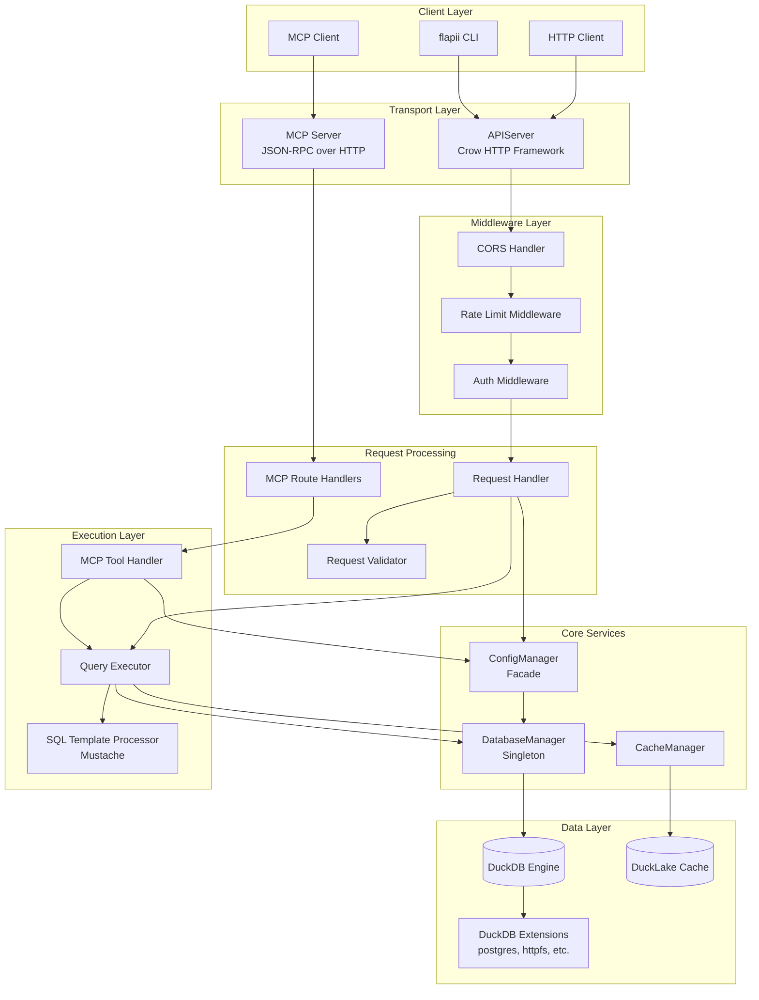

# flAPI Architecture

This document provides a high-level overview of the flAPI system architecture.

## System Overview

flAPI is a SQL-to-API framework that generates REST APIs and MCP tools from SQL templates and YAML configurations. The system consists of several key components that work together to process requests.



## Layered Architecture

flAPI follows a layered architecture pattern with clear separation of concerns:

### Layer 1: User/Config Layer
External inputs that define API behavior:
- **YAML Configurations** (`flapi.yaml`, `sqls/*.yaml`) - Endpoint definitions
- **SQL Templates** (`sqls/*.sql`) - Mustache-based query templates
- **HTTP/MCP Requests** - Client requests from external systems

### Layer 2: Transport Layer
HTTP server infrastructure:
- **APIServer** - Crow HTTP framework for REST endpoints
- **MCPServer** - JSON-RPC transport for MCP protocol
- **Middleware Chain** - CORS, rate limiting, authentication

### Layer 3: Request Processing
Business logic for handling requests:
- **RequestHandler** - REST request processing
- **MCPRouteHandlers** - MCP method dispatch
- **RequestValidator** - Parameter validation

### Layer 4: Core Services
Shared services and state management:
- **ConfigManager** - Configuration facade (see [components/config-system.md](./components/config-system.md))
- **DatabaseManager** - Singleton for DuckDB access (see [components/query-execution.md](./components/query-execution.md))
- **CacheManager** - DuckLake caching (see [components/caching.md](./components/caching.md))

### Layer 5: Execution Layer
Query preparation and execution:
- **QueryExecutor** - Renders templates and executes queries
- **SQLTemplateProcessor** - Mustache template expansion
- **MCPToolHandler** - Converts endpoints to MCP tools

### Layer 6: Data Layer
Storage and external data access:
- **DuckDB** - In-process OLAP database engine
- **Extensions** - Data source connectors (postgres, httpfs, json, etc.)
- **DuckLake** - Table versioning for cached results

## Key Components

| Component | File | Purpose |
|-----------|------|---------|
| **APIServer** | `src/api_server.cpp` | HTTP server, route registration, middleware setup |
| **ConfigManager** | `src/config_manager.cpp` | Facade for configuration loading and access |
| **ConfigLoader** | `src/config_loader.cpp` | YAML parsing and endpoint discovery |
| **ConfigValidator** | `src/config_validator.cpp` | Configuration validation rules |
| **ConfigSerializer** | `src/config_serializer.cpp` | JSON/YAML serialization of configs |
| **EndpointRepository** | `src/endpoint_repository.cpp` | Endpoint storage and lookup |
| **DatabaseManager** | `src/database_manager.cpp` | DuckDB connection management, query execution |
| **QueryExecutor** | `src/query_executor.cpp` | Template rendering and SQL execution |
| **SQLTemplateProcessor** | `src/sql_template_processor.cpp` | Mustache template processing |
| **RequestHandler** | `src/request_handler.cpp` | HTTP request processing |
| **RequestValidator** | `src/request_validator.cpp` | Parameter validation |
| **CacheManager** | `src/cache_manager.cpp` | DuckLake cache operations |
| **HeartbeatWorker** | `src/heartbeat_worker.cpp` | Background cache refresh scheduler |
| **MCPRouteHandlers** | `src/mcp_route_handlers.cpp` | MCP JSON-RPC method handlers |
| **MCPToolHandler** | `src/mcp_tool_handler.cpp` | MCP tool execution |
| **MCPSessionManager** | `src/mcp_session_manager.cpp` | MCP session state |
| **AuthMiddleware** | `src/auth_middleware.cpp` | JWT/Basic/OIDC authentication |
| **RateLimitMiddleware** | `src/rate_limit_middleware.cpp` | Request rate limiting |

## Data Flow

### REST Request Flow

```
1. HTTP Request arrives at APIServer (Crow)
2. Middleware chain executes: CORS → RateLimit → Auth
3. RequestHandler extracts parameters from query/path/body/header
4. RequestValidator applies validation rules
5. ConfigManager provides endpoint configuration
6. SQLTemplateProcessor expands Mustache template with params
7. DatabaseManager/QueryExecutor executes query on DuckDB
8. Results serialized to JSON and returned
```

### MCP Request Flow

```
1. JSON-RPC request arrives at MCP endpoint
2. MCPRouteHandlers parses request and extracts method
3. Request dispatched to appropriate handler (tools/list, tools/call, etc.)
4. MCPToolHandler maps MCP tool call to endpoint configuration
5. Same execution path as REST: template → DuckDB → response
6. Results wrapped in MCP response format
```

For detailed request flows with sequence diagrams, see [REQUEST_LIFECYCLE.md](./REQUEST_LIFECYCLE.md).

## Protocol Support

flAPI supports two protocols from a unified configuration:

### REST API
- Standard HTTP methods: GET, POST, PUT, DELETE, PATCH
- Parameter sources: query string, path, body, headers
- JSON responses
- OpenAPI documentation generation

### MCP (Model Context Protocol)
- JSON-RPC 2.0 over HTTP
- Tools, Resources, and Prompts
- Session management
- AI/LLM integration

See [components/mcp-protocol.md](./components/mcp-protocol.md) for MCP implementation details.

## Extension Points

flAPI can be extended through:

1. **DuckDB Extensions** - Add data source connectors (50+ available)
2. **Custom Validators** - Add validation types beyond built-in
3. **Authentication Providers** - OIDC, custom token validation
4. **Cache Strategies** - Custom refresh logic via templates

## Related Documentation

- [DESIGN_DECISIONS.md](./DESIGN_DECISIONS.md) - Why these patterns were chosen
- [REQUEST_LIFECYCLE.md](./REQUEST_LIFECYCLE.md) - Detailed request flow
- [components/](./components/) - Component-level documentation
