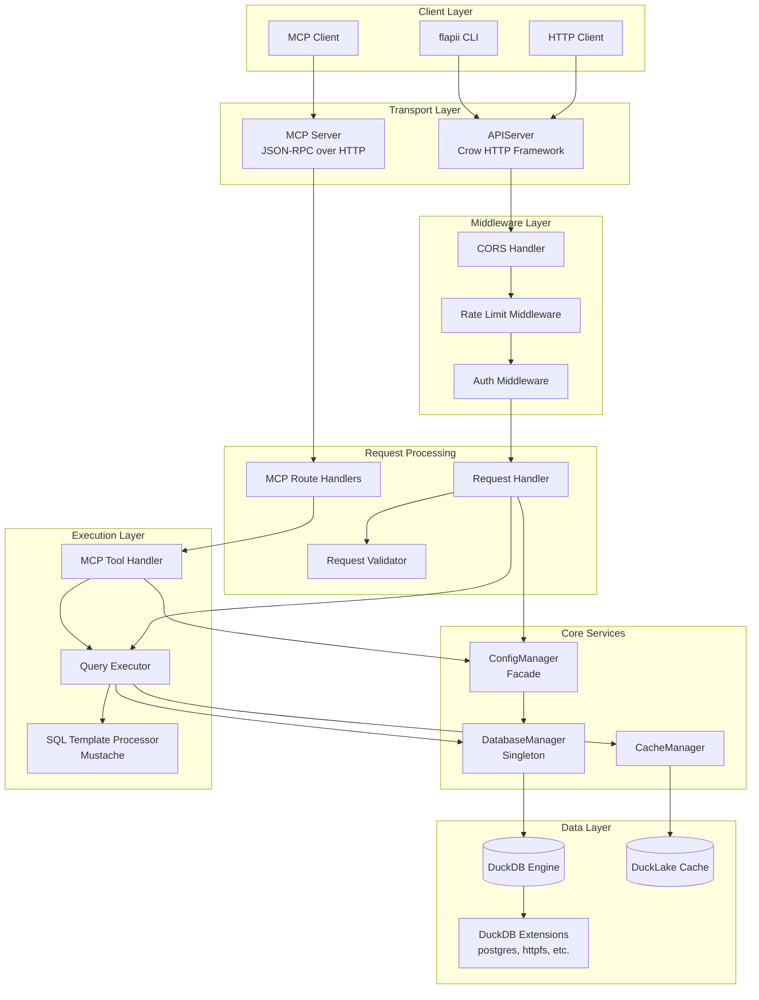

# flAPI Architecture

This document provides a high-level overview of the flAPI system architecture.

## System Overview

flAPI is a SQL-to-API framework that generates REST APIs and MCP tools from SQL templates and YAML configurations. The system consists of several key components that work together to process requests.


```mermaid
graph TB
    subgraph "Client Layer"
        HTTP[HTTP Client]
        MCP[MCP Client]
        CLI[flapii CLI]
    end

    subgraph "Transport Layer"
        APIServer[APIServer<br/>Crow HTTP Framework]
        MCPServer[MCP Server<br/>JSON-RPC over HTTP]
    end

    subgraph "Middleware Layer"
        CORS[CORS Handler]
        RateLimit[Rate Limit Middleware]
        Auth[Auth Middleware]
    end

    subgraph "Request Processing"
        RequestHandler[Request Handler]
        MCPRouteHandlers[MCP Route Handlers]
        Validator[Request Validator]
    end

    subgraph "Core Services"
        ConfigManager[ConfigManager<br/>Facade]
        DatabaseManager[DatabaseManager<br/>Singleton]
        CacheManager[CacheManager]
    end

    subgraph "Execution Layer"
        QueryExecutor[Query Executor]
        SQLTemplateProcessor[SQL Template Processor<br/>Mustache]
        MCPToolHandler[MCP Tool Handler]
    end

    subgraph "Data Layer"
        DuckDB[(DuckDB Engine)]
        Extensions[DuckDB Extensions<br/>postgres, httpfs, etc.]
        DuckLake[(DuckLake Cache)]
    end

    HTTP --> APIServer
    MCP --> MCPServer
    CLI --> APIServer

    APIServer --> CORS --> RateLimit --> Auth
    MCPServer --> MCPRouteHandlers

    Auth --> RequestHandler
    MCPRouteHandlers --> MCPToolHandler

    RequestHandler --> Validator
    RequestHandler --> ConfigManager
    RequestHandler --> QueryExecutor

    MCPToolHandler --> ConfigManager
    MCPToolHandler --> QueryExecutor

    ConfigManager --> DatabaseManager
    QueryExecutor --> SQLTemplateProcessor
    QueryExecutor --> DatabaseManager
    QueryExecutor --> CacheManager

    DatabaseManager --> DuckDB
    DuckDB --> Extensions
    CacheManager --> DuckLake
```

## Layered Architecture

flAPI follows a layered architecture pattern with clear separation of concerns:

### Layer 1: User/Config Layer
External inputs that define API behavior:
- **YAML Configurations** (`flapi.yaml`, `sqls/*.yaml`) - Endpoint definitions
- **SQL Templates** (`sqls/*.sql`) - Mustache-based query templates
- **HTTP/MCP Requests** - Client requests from external systems

### Layer 2: Transport Layer
HTTP server infrastructure:
- **APIServer** - Crow HTTP framework for REST endpoints
- **MCPServer** - JSON-RPC transport for MCP protocol
- **Middleware Chain** - CORS, rate limiting, authentication

### Layer 3: Request Processing
Business logic for handling requests:
- **RequestHandler** - REST request processing
- **MCPRouteHandlers** - MCP method dispatch
- **RequestValidator** - Parameter validation

### Layer 4: Core Services
Shared services and state management:
- **ConfigManager** - Configuration facade (see [components/config-system.md](./components/config-system.md))
- **DatabaseManager** - Singleton for DuckDB access (see [components/query-execution.md](./components/query-execution.md))
- **CacheManager** - DuckLake caching (see [components/caching.md](./components/caching.md))

### Layer 5: Execution Layer
Query preparation and execution:
- **QueryExecutor** - Renders templates and executes queries
- **SQLTemplateProcessor** - Mustache template expansion
- **MCPToolHandler** - Converts endpoints to MCP tools

### Layer 6: Data Layer
Storage and external data access:
- **DuckDB** - In-process OLAP database engine
- **Extensions** - Data source connectors (postgres, httpfs, json, etc.)
- **DuckLake** - Table versioning for cached results

## Key Components

| Component | File | Purpose |
|-----------|------|---------|
| **APIServer** | `src/api_server.cpp` | HTTP server, route registration, middleware setup |
| **ConfigManager** | `src/config_manager.cpp` | Facade for configuration loading and access |
| **ConfigLoader** | `src/config_loader.cpp` | YAML parsing and endpoint discovery |
| **ConfigValidator** | `src/config_validator.cpp` | Configuration validation rules |
| **ConfigSerializer** | `src/config_serializer.cpp` | JSON/YAML serialization of configs |
| **EndpointRepository** | `src/endpoint_repository.cpp` | Endpoint storage and lookup |
| **DatabaseManager** | `src/database_manager.cpp` | DuckDB connection management, query execution |
| **QueryExecutor** | `src/query_executor.cpp` | Template rendering and SQL execution |
| **SQLTemplateProcessor** | `src/sql_template_processor.cpp` | Mustache template processing |
| **RequestHandler** | `src/request_handler.cpp` | HTTP request processing |
| **RequestValidator** | `src/request_validator.cpp` | Parameter validation |
| **CacheManager** | `src/cache_manager.cpp` | DuckLake cache operations |
| **HeartbeatWorker** | `src/heartbeat_worker.cpp` | Background cache refresh scheduler |
| **MCPRouteHandlers** | `src/mcp_route_handlers.cpp` | MCP JSON-RPC method handlers |
| **MCPToolHandler** | `src/mcp_tool_handler.cpp` | MCP tool execution |
| **MCPSessionManager** | `src/mcp_session_manager.cpp` | MCP session state |
| **AuthMiddleware** | `src/auth_middleware.cpp` | JWT/Basic/OIDC authentication |
| **RateLimitMiddleware** | `src/rate_limit_middleware.cpp` | Request rate limiting |

### Self-Packaging (optional)

These components are loaded only when the running binary contains an
appended (or, on macOS, in-section) ZIP bundle. They let the same
artifact serve the API _and_ produce new bundled artifacts via
`flapi pack`.

| Component | File | Purpose |
|-----------|------|---------|
| **archive_io** | `src/archive_io.cpp` | RAII wrapper around libarchive; reads/writes ZIPs in memory, with `bytes_in_last_block=1` and `SOURCE_DATE_EPOCH` mtime stamping for reproducible builds. |
| **selfpath** | `src/selfpath.cpp` | Cross-platform self-binary path (`/proc/self/exe`, `_NSGetExecutablePath`, `GetModuleFileNameW`). |
| **bundle_locator** | `src/bundle_locator.cpp` | Reverse-scans for the ZIP EOCD record (Linux/Windows); on macOS prefers the reserved `__FLAPI/__bundle` Mach-O section. Tolerates trailing zero padding. |
| **macho_bundle** | `src/macho_bundle.cpp` | 64-bit Mach-O header + LC_SEGMENT_64 parser; writes the archive into the reserved section in place and re-invokes `codesign`. |
| **EmbeddedArchiveFileProvider** | `src/embedded_archive_file_provider.cpp` | `IFileProvider` implementation backed by a `std::shared_ptr<const ArchiveEntries>`. Sibling of `LocalFileProvider` / `DuckDBVFSProvider`. |
| **EmbeddedFileSystem** | `src/duckdb_embed_fs.cpp` | `duckdb::FileSystem` for the `embed://` scheme. Lets SQL templates do `read_csv('embed://data/x.csv')`. Same `ArchiveEntries` instance as `EmbeddedArchiveFileProvider`. |
| **pack** | `src/pack.cpp` | `flapi pack` / `info` / `unpack` subcommand logic. Enforces a default secret deny list (`*.env`, `secrets/*`, `*.pem`, `*.key`). |

## Data Flow

### REST Request Flow

```
1. HTTP Request arrives at APIServer (Crow)
2. Middleware chain executes: CORS → RateLimit → Auth
3. RequestHandler extracts parameters from query/path/body/header
4. RequestValidator applies validation rules
5. ConfigManager provides endpoint configuration
6. SQLTemplateProcessor expands Mustache template with params
7. DatabaseManager/QueryExecutor executes query on DuckDB
8. Results serialized to JSON and returned
```

### MCP Request Flow

```
1. JSON-RPC request arrives at MCP endpoint
2. MCPRouteHandlers parses request and extracts method
3. Request dispatched to appropriate handler (tools/list, tools/call, etc.)
4. MCPToolHandler maps MCP tool call to endpoint configuration
5. Same execution path as REST: template → DuckDB → response
6. Results wrapped in MCP response format
```

For detailed request flows with sequence diagrams, see [REQUEST_LIFECYCLE.md](./REQUEST_LIFECYCLE.md).

### Self-Packaging Bootstrap

When `flapi` starts, _before_ loading the config:

```
1. main() calls detectAndRegisterEmbeddedBundle()
   ├─ bundle_locator::LocateBundleInSelf()
   │    macOS: probe __FLAPI/__bundle Mach-O section first
   │    fallback: reverse-scan EOCD signature from EOF
   ├─ if bundle found: read slice → archive_io::ReadArchive()
   └─ store entries in FileProviderFactory (process-wide shared_ptr)

2. main() proceeds to initializeConfig()
   ConfigLoader.loadYamlFile("flapi.yaml")
   ├─ FileProviderFactory::CreateProvider("flapi.yaml")
   │    bundle present + non-remote path → EmbeddedArchiveFileProvider
   │    no bundle              + non-remote → LocalFileProvider
   │    any remote scheme                    → DuckDBVFSProvider
   └─ provider.ReadFile() returns bytes (from bundle or disk)

3. After DatabaseManager is up, main() calls
   RegisterEmbeddedFileSystem() which adds the embed:// VFS to
   DuckDB so SQL templates can `read_csv('embed://data/foo.csv')`.
```

If no bundle is present (Linux/Windows shipped without `pack`, or
the trailing 1 KiB has been truncated), all bundle-aware components
silently return nullopt and the binary serves from the local
filesystem -- existing behaviour, zero churn.

## Protocol Support

flAPI supports two protocols from a unified configuration:

### REST API
- Standard HTTP methods: GET, POST, PUT, DELETE, PATCH
- Parameter sources: query string, path, body, headers
- JSON responses
- OpenAPI documentation generation

### MCP (Model Context Protocol)
- JSON-RPC 2.0 over HTTP
- Tools, Resources, and Prompts
- Session management
- AI/LLM integration

See [components/mcp-protocol.md](./components/mcp-protocol.md) for MCP implementation details.

## Extension Points

flAPI can be extended through:

1. **DuckDB Extensions** - Add data source connectors (50+ available)
2. **Custom Validators** - Add validation types beyond built-in
3. **Authentication Providers** - OIDC, custom token validation
4. **Cache Strategies** - Custom refresh logic via templates

## Related Documentation

- [DESIGN_DECISIONS.md](./DESIGN_DECISIONS.md) - Why these patterns were chosen
- [REQUEST_LIFECYCLE.md](./REQUEST_LIFECYCLE.md) - Detailed request flow
- [components/](./components/) - Component-level documentation
