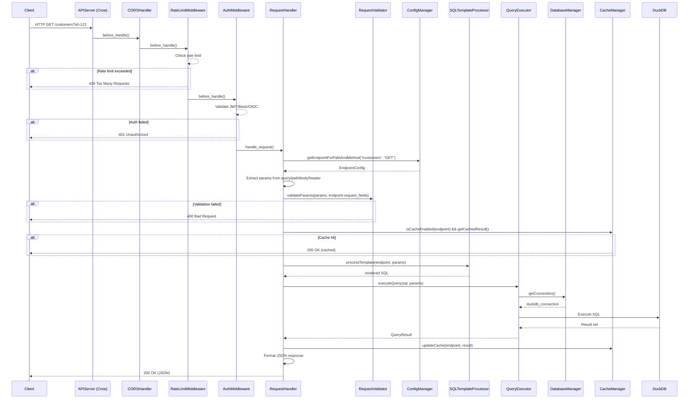
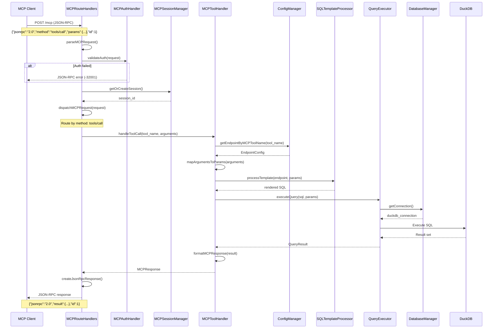
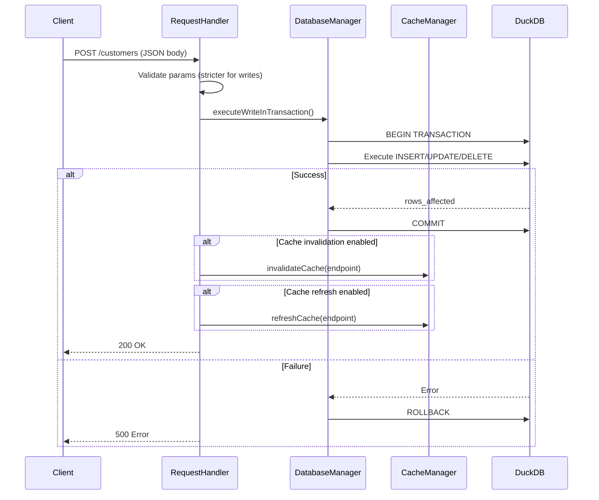

# Request Lifecycle

This document describes the end-to-end flow of requests through flAPI for both REST and MCP protocols.

## REST Request Flow

### Sequence Diagram



### REST Request Processing Steps

#### 1. Request Reception (api_server.cpp)
The Crow HTTP server receives the request and routes it through the middleware chain.

```cpp
// Route registration
CROW_ROUTE(app, "/api/<path>")
    .methods("GET"_method, "POST"_method, ...)
    ([this](const crow::request& req, const std::string& path) {
        return handleRequest(req, path);
    });
```

#### 2. Middleware Processing

**CORS Handler** (built-in Crow middleware):
- Adds CORS headers for cross-origin requests
- Handles preflight OPTIONS requests

**Rate Limit Middleware** (`src/rate_limit_middleware.cpp`):
- Tracks request counts per client IP
- Returns 429 if rate limit exceeded
- Configurable via `rate_limit` in `flapi.yaml`

**Auth Middleware** (`src/auth_middleware.cpp`):
- Extracts credentials from `Authorization` header
- Validates JWT tokens, Basic auth, or OIDC tokens
- Sets `auth_context` for downstream handlers
- Returns 401 if authentication fails

#### 3. Parameter Extraction (request_handler.cpp)

Parameters are extracted based on `field-in` configuration:

| `field-in` | Source | Example |
|------------|--------|---------|
| `query` | URL query string | `?id=123` |
| `path` | URL path segments | `/customers/123` |
| `body` | Request body (JSON) | `{"id": 123}` |
| `header` | HTTP headers | `X-Custom-Id: 123` |

```cpp
std::map<std::string, std::string> params;
for (const auto& field : endpoint.request_fields) {
    if (field.fieldIn == "query") {
        params[field.fieldName] = req.url_params.get(field.fieldName);
    } else if (field.fieldIn == "path") {
        params[field.fieldName] = extractPathParam(req, field.fieldName);
    }
    // ...
}
```

#### 4. Validation (request_validator.cpp)

Each parameter is validated against its configured validators:

```yaml
validators:
  - type: int
    min: 1
    max: 999999
  - type: string
    pattern: "^[a-zA-Z0-9]+$"
```

Validation failure returns 400 with details:
```json
{
  "error": "Validation failed",
  "field": "id",
  "message": "Value must be a positive integer"
}
```

#### 5. Cache Check (cache_manager.cpp)

If caching is enabled for the endpoint:
1. Check if cached result exists and is valid (within TTL)
2. Return cached result if available
3. Continue to query execution if cache miss

#### 6. Template Processing (sql_template_processor.cpp)

Mustache template is expanded with parameters:

**Input template:**
```sql
SELECT * FROM customers
WHERE 1=1
{{#params.id}}
  AND customer_id = {{{ params.id }}}
{{/params.id}}
```

**With params `{id: "123"}`:**
```sql
SELECT * FROM customers
WHERE 1=1
  AND customer_id = '123'
```

#### 7. Query Execution (query_executor.cpp, database_manager.cpp)

1. Get connection from DatabaseManager pool
2. Execute SQL on DuckDB
3. Convert result to QueryResult struct
4. Return connection to pool

#### 8. Response Serialization

Results are serialized to JSON and returned:
```json
{
  "data": [
    {"customer_id": 123, "name": "Alice", ...}
  ],
  "meta": {
    "total": 1,
    "cached": false
  }
}
```

---

## MCP Request Flow

### Sequence Diagram



### MCP Methods

| Method | Handler | Description |
|--------|---------|-------------|
| `initialize` | `handleInitializeRequest` | Protocol handshake, capability negotiation |
| `tools/list` | `handleToolsListRequest` | List available tools |
| `tools/call` | `handleToolsCallRequest` | Execute a tool |
| `resources/list` | `handleResourcesListRequest` | List available resources |
| `resources/read` | `handleResourcesReadRequest` | Read a resource |
| `prompts/list` | `handlePromptsListRequest` | List available prompts |
| `prompts/get` | `handlePromptsGetRequest` | Get a prompt template |
| `ping` | `handlePingRequest` | Health check |

### MCP Request Processing Steps

#### 1. JSON-RPC Parsing (mcp_route_handlers.cpp)

```cpp
std::optional<MCPRequest> parseMCPRequest(const crow::request& req) {
    auto json = crow::json::load(req.body);
    MCPRequest request;
    request.jsonrpc = json["jsonrpc"].s();
    request.method = json["method"].s();
    request.params = json["params"];
    request.id = json["id"].s();
    return request;
}
```

#### 2. Session Management (mcp_session_manager.cpp)

- Extract session ID from `Mcp-Session-Id` header
- Create new session if not exists
- Store client capabilities for the session

#### 3. Method Dispatch

Request is routed to appropriate handler based on `method`:

```cpp
MCPResponse dispatchMCPRequest(const MCPRequest& request) {
    if (request.method == "initialize") {
        return handleInitializeRequest(request);
    } else if (request.method == "tools/list") {
        return handleToolsListRequest(request);
    } else if (request.method == "tools/call") {
        return handleToolsCallRequest(request);
    }
    // ...
}
```

#### 4. Tool Execution (mcp_tool_handler.cpp)

For `tools/call`:
1. Look up endpoint by MCP tool name
2. Map MCP arguments to endpoint parameters
3. Process template and execute query
4. Format result in MCP content format

```cpp
// Argument mapping
std::map<std::string, std::string> params;
for (const auto& field : endpoint.request_fields) {
    if (arguments.has(field.fieldName)) {
        params[field.fieldName] = arguments[field.fieldName].s();
    }
}
```

#### 5. Response Formatting

MCP responses follow JSON-RPC 2.0 format:

**Success:**
```json
{
  "jsonrpc": "2.0",
  "result": {
    "content": [
      {
        "type": "text",
        "text": "{\"data\": [...]}"
      }
    ]
  },
  "id": 1
}
```

**Error:**
```json
{
  "jsonrpc": "2.0",
  "error": {
    "code": -32602,
    "message": "Invalid params"
  },
  "id": 1
}
```

---

## Write Operation Flow

Write operations (POST, PUT, DELETE with `operation.type: write`) follow a similar flow with additional considerations:

### Sequence Diagram



### Write-Specific Configuration

```yaml
operation:
  type: write                    # Marks as write operation
  transaction: true              # Wrap in transaction (default)
  returns_data: true             # Use RETURNING clause
  validate_before_write: true    # Stricter validation

cache:
  invalidate_on_write: true      # Clear cache after write
  refresh_on_write: false        # Optionally refresh immediately
```

---

## Code Path Reference

| Step | REST | MCP |
|------|------|-----|
| Entry point | `src/api_server.cpp` | `src/mcp_route_handlers.cpp` |
| Auth | `src/auth_middleware.cpp` | `src/mcp_auth_handler.cpp` |
| Config lookup | `ConfigManager::getEndpointForPathAndMethod` | `ConfigManager::getEndpointForPath` |
| Validation | `src/request_validator.cpp` | `src/mcp_tool_handler.cpp` |
| Template | `src/sql_template_processor.cpp` | `src/sql_template_processor.cpp` |
| Execution | `src/query_executor.cpp` | `src/query_executor.cpp` |
| Cache | `src/cache_manager.cpp` | `src/cache_manager.cpp` |

---

## Error Handling

### HTTP Status Codes (REST)

| Code | Cause |
|------|-------|
| 400 | Validation failure, bad request format |
| 401 | Authentication required/failed |
| 403 | Authorization denied (insufficient roles) |
| 404 | Endpoint not found |
| 429 | Rate limit exceeded |
| 500 | Query execution error, server error |

### JSON-RPC Error Codes (MCP)

| Code | Meaning |
|------|---------|
| -32700 | Parse error |
| -32600 | Invalid request |
| -32601 | Method not found |
| -32602 | Invalid params |
| -32603 | Internal error |
| -32001 | Authentication error |
| -32002 | Tool not found |

---

## Related Documentation

- [ARCHITECTURE.md](./ARCHITECTURE.md) - Component overview
- [components/config-system.md](./components/config-system.md) - Configuration loading
- [components/query-execution.md](./components/query-execution.md) - SQL execution details
- [components/security.md](./components/security.md) - Auth and validation
