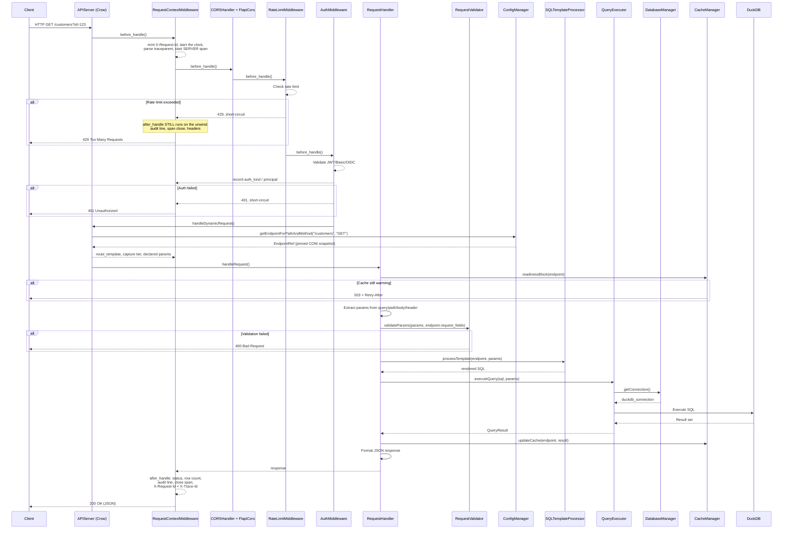
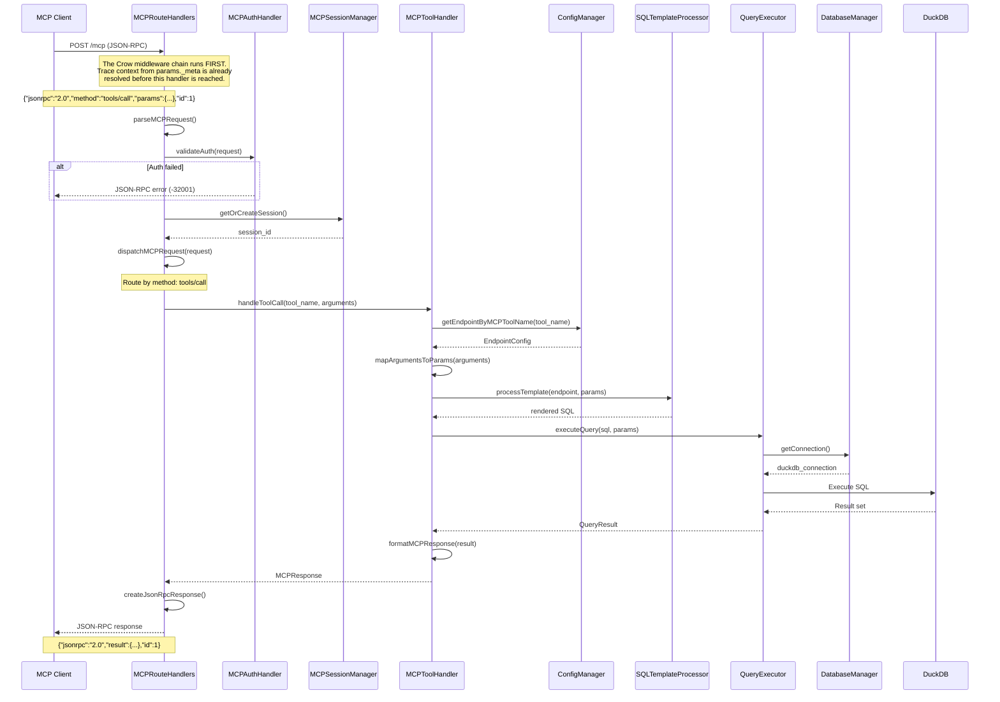
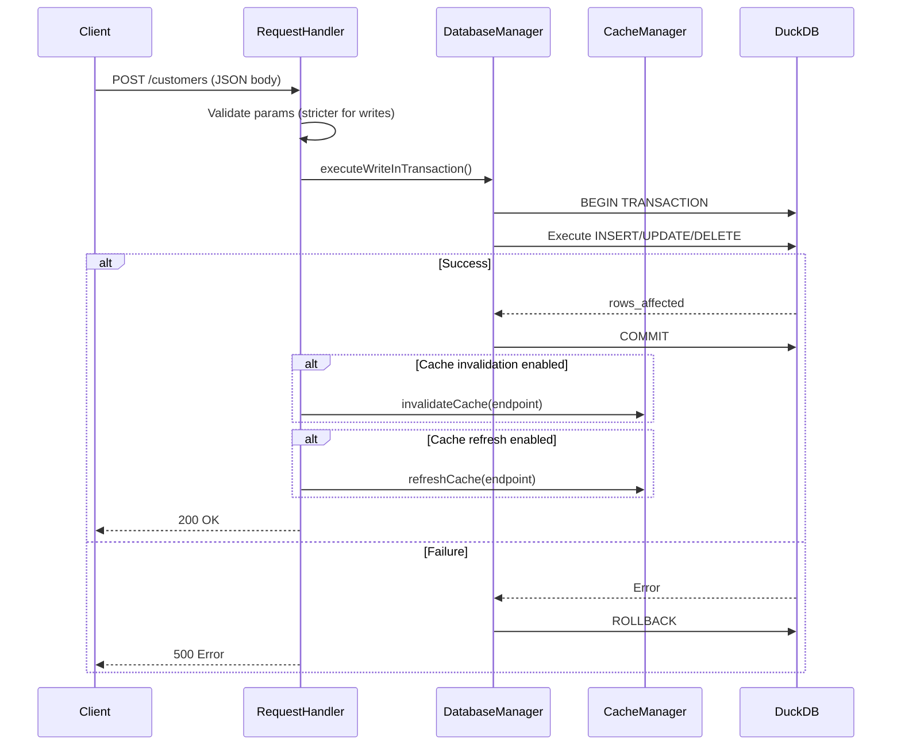

# Request Lifecycle

This document describes the end-to-end flow of requests through flAPI for both REST and MCP protocols.

## REST Request Flow

### Sequence Diagram


```mermaid
sequenceDiagram
    participant Client
    participant Crow as APIServer (Crow)
    participant RCM as RequestContextMiddleware
    participant CORS as CORSHandler + FlapiCors
    participant RL as RateLimitMiddleware
    participant Auth as AuthMiddleware
    participant RH as RequestHandler
    participant RV as RequestValidator
    participant CM as ConfigManager
    participant STP as SQLTemplateProcessor
    participant QE as QueryExecutor
    participant DM as DatabaseManager
    participant Cache as CacheManager
    participant DuckDB

    Client->>Crow: HTTP GET /customers?id=123
    Crow->>RCM: before_handle()
    RCM-->>RCM: mint X-Request-Id, start the clock,<br/>parse traceparent, start SERVER span
    RCM->>CORS: before_handle()
    CORS->>RL: before_handle()
    RL-->>RL: Check rate limit
    alt Rate limit exceeded
        RL-->>RCM: 429, short-circuit
        Note over RCM: after_handle STILL runs on the unwind:<br/>audit line, span close, headers
        RCM-->>Client: 429 Too Many Requests
    end
    RL->>Auth: before_handle()
    Auth-->>Auth: Validate JWT/Basic/OIDC
    Auth-->>RCM: record auth_kind / principal
    alt Auth failed
        Auth-->>RCM: 401, short-circuit
        RCM-->>Client: 401 Unauthorized
    end
    Auth->>Crow: handleDynamicRequest()

    Crow->>CM: getEndpointForPathAndMethod("/customers", "GET")
    CM-->>Crow: EndpointRef (pinned COW snapshot)
    Crow-->>RCM: route_template, capture tier, declared params
    Crow->>RH: handleRequest()

    RH->>Cache: readinessBlock(endpoint)
    alt Cache still warming
        Cache-->>Client: 503 + Retry-After
    end

    RH->>RH: Extract params from query/path/body/header
    RH->>RV: validateParams(params, endpoint.request_fields)
    alt Validation failed
        RV-->>Client: 400 Bad Request
    end

    RH->>STP: processTemplate(endpoint, params)
    STP-->>RH: rendered SQL

    RH->>QE: executeQuery(sql, params)
    QE->>DM: getConnection()
    DM-->>QE: duckdb_connection
    QE->>DuckDB: Execute SQL
    DuckDB-->>QE: Result set
    QE-->>RH: QueryResult

    RH->>Cache: updateCache(endpoint, result)
    RH->>RH: Format JSON response
    RH-->>RCM: response
    RCM-->>RCM: after_handle: status, row count,<br/>audit line, close span,<br/>X-Request-Id + X-Trace-Id
    RCM-->>Client: 200 OK (JSON)
```

> **The unwind is the point.** `after_handle` runs in reverse declaration order
> **and it runs on a short-circuit too** — Crow unwinds through every outer
> middleware. That is why a 401 or 429 still produces an audit line, a closed
> span and an `X-Request-Id`, even though it never reached the handler. Getting
> this backwards once produced a duplicate audit line on every 401.
> See `crow/middleware.h` for the authority.

### REST Request Processing Steps

#### 1. Request Reception (api_server.cpp)
The Crow HTTP server receives the request and routes it through the middleware chain.

```cpp
// Route registration
CROW_ROUTE(app, "/api/<path>")
    .methods("GET"_method, "POST"_method, ...)
    ([this](const crow::request& req, const std::string& path) {
        return handleRequest(req, path);
    });
```

#### 2. Middleware Processing

The chain is declared once, in `src/include/flapi_app.hpp`. Spelling
`crow::App<...>` anywhere else creates a second, unconfigured middleware tuple;
CI rejects it.

**RequestContextMiddleware** (`src/request_context_middleware.cpp`) — leftmost:
- Mints `X-Request-Id`. **Always server-minted**; an inbound header is never
  honoured, so a caller cannot choose their own id or collide with another's.
- Starts the single `steady_clock` reading that times the whole request.
- Parses `traceparent` from the HTTP header, and for `POST /mcp/jsonrpc` peeks
  the body (bounded at 64 KiB, since this runs *before* auth) for SEP-414
  `params._meta`. `_meta` wins on disagreement.
- Starts the HTTP SERVER span, on **every** route — including ones rejected
  later. Instrumenting the handler instead would miss 401, 403, 429, preflights
  and 404s entirely.
- In `after_handle`: records status and row count, writes the audit line, closes
  the span, sets `X-Request-Id` and (when traced) `X-Trace-Id`.

Everything except the span survives `FLAPI_WITH_TRACING=OFF`: the request id, log
correlation and REST audit coverage are not tracing features.

**CORS Handler** (built-in Crow middleware):
- Adds CORS headers for cross-origin requests
- Handles preflight OPTIONS requests

**FlapiCorsMiddleware** (`src/cors_middleware.cpp`):
- flAPI's own origin selection, layered on Crow's handler

**Rate Limit Middleware** (`src/rate_limit_middleware.cpp`):
- Tracks request counts per client IP
- Returns 429 if rate limit exceeded
- Configurable via `rate_limit` in `flapi.yaml`
- A 429 is audited and traced like any other outcome, via the unwind above

**Auth Middleware** (`src/auth_middleware.cpp`):
- Extracts credentials from `Authorization` header
- Validates JWT tokens, Basic auth, or OIDC tokens
- Sets `auth_context` for downstream handlers
- Records `auth_kind` and `principal` on the ambient `RequestContext`
- Returns 401 if authentication fails — and deliberately does **not** complete
  the request itself. The unwind reaches `RequestContextMiddleware`, which writes
  the single audit line. Completing it here emitted two.

#### 3. Parameter Extraction (request_handler.cpp)

Parameters are extracted based on `field-in` configuration:

| `field-in` | Source | Example |
|------------|--------|---------|
| `query` | URL query string | `?id=123` |
| `path` | URL path segments | `/customers/123` |
| `body` | Request body (JSON) | `{"id": 123}` |
| `header` | HTTP headers | `X-Custom-Id: 123` |

```cpp
std::map<std::string, std::string> params;
for (const auto& field : endpoint.request_fields) {
    if (field.fieldIn == "query") {
        params[field.fieldName] = req.url_params.get(field.fieldName);
    } else if (field.fieldIn == "path") {
        params[field.fieldName] = extractPathParam(req, field.fieldName);
    }
    // ...
}
```

#### 4. Validation (request_validator.cpp)

Each parameter is validated against its configured validators:

```yaml
validators:
  - type: int
    min: 1
    max: 999999
  - type: string
    pattern: "^[a-zA-Z0-9]+$"
```

Validation failure returns 400 with details:
```json
{
  "error": "Validation failed",
  "field": "id",
  "message": "Value must be a positive integer"
}
```

#### 5. Cache readiness (cache_manager.cpp)

**There is no per-request cache hit/miss check.** The "cache" is a materialised
DuckLake table that the endpoint's template queries directly, refreshed on a
schedule by `HeartbeatWorker`. A cached endpoint runs the same SQL path as any
other; it simply reads a table that is already populated. Earlier revisions of
this document described a per-request hit/miss branch that never existed.

What *does* happen per request is a **readiness check**: if the cache table for
this endpoint is still warming, `RequestHandler::handleRequest` short-circuits
with a 503 and a `Retry-After` header rather than serving an empty table.

See [components/caching.md](./components/caching.md) for the refresh lifecycle.

#### 6. Template Processing (sql_template_processor.cpp)

Mustache template is expanded with parameters:

**Input template:**
```sql
SELECT * FROM customers
WHERE 1=1
{{#params.id}}
  AND customer_id = {{{ params.id }}}
{{/params.id}}
```

**With params `{id: "123"}`:**
```sql
SELECT * FROM customers
WHERE 1=1
  AND customer_id = '123'
```

#### 7. Query Execution (query_executor.cpp, database_manager.cpp)

1. Get connection from DatabaseManager pool
2. Execute SQL on DuckDB
3. Convert result to QueryResult struct
4. Return connection to pool

Template rendering emits a `flapi.render_template` INTERNAL span, parented by the
ambient active-span stack with no signature changes. A DuckDB CLIENT span is
emitted on the **unprepared** path only; endpoints with typed request fields run
through `executeWithBindings` → `executePrepared`, which is not yet instrumented.

#### 8. Response Serialization

Results are serialized to JSON and returned:
```json
{
  "data": [
    {"customer_id": 123, "name": "Alice", ...}
  ],
  "meta": {
    "total": 1,
    "cached": false
  }
}
```

Every response also carries `X-Request-Id`, and `X-Trace-Id` when a span was
produced. `X-Trace-Id` is the **caller's** trace id when they supplied a valid
`traceparent`, so both sides join on one value.

---

## MCP Request Flow

### Sequence Diagram


```mermaid
sequenceDiagram
    participant Client as MCP Client
    participant MRH as MCPRouteHandlers
    participant Auth as MCPAuthHandler
    participant SM as MCPSessionManager
    participant MTH as MCPToolHandler
    participant CM as ConfigManager
    participant STP as SQLTemplateProcessor
    participant QE as QueryExecutor
    participant DM as DatabaseManager
    participant DuckDB

    Client->>MRH: POST /mcp (JSON-RPC)
    Note over MRH: The Crow middleware chain runs FIRST.<br/>Trace context from params._meta is already<br/>resolved before this handler is reached.
    Note over Client,MRH: {"jsonrpc":"2.0","method":"tools/call","params":{...},"id":1}

    MRH->>MRH: parseMCPRequest()
    MRH->>Auth: validateAuth(request)
    alt Auth failed
        Auth-->>Client: JSON-RPC error (-32001)
    end

    MRH->>SM: getOrCreateSession()
    SM-->>MRH: session_id

    MRH->>MRH: dispatchMCPRequest(request)
    Note over MRH: Route by method: tools/call

    MRH->>MTH: handleToolCall(tool_name, arguments)
    MTH->>CM: getEndpointByMCPToolName(tool_name)
    CM-->>MTH: EndpointConfig

    MTH->>MTH: mapArgumentsToParams(arguments)
    MTH->>STP: processTemplate(endpoint, params)
    STP-->>MTH: rendered SQL

    MTH->>QE: executeQuery(sql, params)
    QE->>DM: getConnection()
    DM-->>QE: duckdb_connection
    QE->>DuckDB: Execute SQL
    DuckDB-->>QE: Result set
    QE-->>MTH: QueryResult

    MTH->>MTH: formatMCPResponse(result)
    MTH-->>MRH: MCPResponse

    MRH->>MRH: createJsonRpcResponse()
    MRH-->>Client: JSON-RPC response
    Note over Client,MRH: {"jsonrpc":"2.0","result":{...},"id":1}
```

### MCP Methods

| Method | Handler | Description |
|--------|---------|-------------|
| `initialize` | `handleInitializeRequest` | Protocol handshake, capability negotiation |
| `tools/list` | `handleToolsListRequest` | List available tools |
| `tools/call` | `handleToolsCallRequest` | Execute a tool |
| `resources/list` | `handleResourcesListRequest` | List available resources |
| `resources/read` | `handleResourcesReadRequest` | Read a resource |
| `prompts/list` | `handlePromptsListRequest` | List available prompts |
| `prompts/get` | `handlePromptsGetRequest` | Get a prompt template |
| `ping` | `handlePingRequest` | Health check |

### MCP Request Processing Steps

#### 1. JSON-RPC Parsing (mcp_route_handlers.cpp)

```cpp
// Note: MCPRequest also carries meta_trace_context, populated from params._meta
// per SEP-414 (unprefixed traceparent / tracestate / baggage), parsed even when
// tracing is disabled so correlation ids still reach the audit and app logs.
std::optional<MCPRequest> parseMCPRequest(const crow::request& req) {
    auto json = crow::json::load(req.body);
    MCPRequest request;
    request.jsonrpc = json["jsonrpc"].s();
    request.method = json["method"].s();
    request.params = json["params"];
    request.id = json["id"].s();
    return request;
}
```

#### 2. Session Management (mcp_session_manager.cpp)

- Extract session ID from `Mcp-Session-Id` header
- Create new session if not exists
- Store client capabilities for the session

#### 3. Method Dispatch

The method name is passed through `knownMcpMethodOrUnknown()` before it is used
as a span name or metric dimension. A caller-supplied method would otherwise mint
unbounded span names and place attacker-controlled JSON into the export. The tool
name in `tools/call` is gated the same way: it is recorded only once it resolves
against the configured endpoints, and unknown names collapse to
`<unknown_tool>`.

flAPI also enforces that the `MCP-Protocol-Version` header matches
`_meta.protocolVersion` when both are present.


Request is routed to appropriate handler based on `method`:

```cpp
MCPResponse dispatchMCPRequest(const MCPRequest& request) {
    if (request.method == "initialize") {
        return handleInitializeRequest(request);
    } else if (request.method == "tools/list") {
        return handleToolsListRequest(request);
    } else if (request.method == "tools/call") {
        return handleToolsCallRequest(request);
    }
    // ...
}
```

#### 4. Tool Execution (mcp_tool_handler.cpp)

**One MCP call is one span and one audit line.** The span is named
`tools/call <tool>` and carries both the `http.*` and the `mcp.*`/`gen_ai.*`
attribute sets, rather than a generic `POST /mcp/jsonrpc` span plus a child. The
tool handler sets `audit_suppressed` so the HTTP middleware does not also write a
line and report the same work twice under two names.

Denials are the exception: 401, 403 and 429 are **never** suppressed. Silence on
exactly the events a reviewer is looking for is the worst possible default.

This contract assumes strictly one JSON-RPC call per HTTP request. Batching or
SSE would break it, and both are currently rejected.


For `tools/call`:
1. Look up endpoint by MCP tool name
2. Map MCP arguments to endpoint parameters
3. Process template and execute query
4. Format result in MCP content format

```cpp
// Argument mapping
std::map<std::string, std::string> params;
for (const auto& field : endpoint.request_fields) {
    if (arguments.has(field.fieldName)) {
        params[field.fieldName] = arguments[field.fieldName].s();
    }
}
```

#### 5. Response Formatting

MCP responses follow JSON-RPC 2.0 format:

**Success:**
```json
{
  "jsonrpc": "2.0",
  "result": {
    "content": [
      {
        "type": "text",
        "text": "{\"data\": [...]}"
      }
    ]
  },
  "id": 1
}
```

**Error:**
```json
{
  "jsonrpc": "2.0",
  "error": {
    "code": -32602,
    "message": "Invalid params"
  },
  "id": 1
}
```

---

## Write Operation Flow

Write operations (POST, PUT, DELETE with `operation.type: write`) follow a similar flow with additional considerations:

### Sequence Diagram


```mermaid
sequenceDiagram
    participant Client
    participant RH as RequestHandler
    participant DM as DatabaseManager
    participant Cache as CacheManager
    participant DuckDB

    Client->>RH: POST /customers (JSON body)
    RH->>RH: Validate params (stricter for writes)

    RH->>DM: executeWriteInTransaction()
    DM->>DuckDB: BEGIN TRANSACTION
    DM->>DuckDB: Execute INSERT/UPDATE/DELETE

    alt Success
        DuckDB-->>DM: rows_affected
        DM->>DuckDB: COMMIT

        alt Cache invalidation enabled
            RH->>Cache: invalidateCache(endpoint)
        end

        alt Cache refresh enabled
            RH->>Cache: refreshCache(endpoint)
        end

        RH-->>Client: 200 OK
    else Failure
        DuckDB-->>DM: Error
        DM->>DuckDB: ROLLBACK
        RH-->>Client: 500 Error
    end
```

### Write-Specific Configuration

```yaml
operation:
  type: write                    # Marks as write operation
  transaction: true              # Wrap in transaction (default)
  returns_data: true             # Use RETURNING clause
  validate_before_write: true    # Stricter validation

cache:
  invalidate_on_write: true      # Clear cache after write
  refresh_on_write: false        # Optionally refresh immediately
```

---

## Code Path Reference

| Step | REST | MCP |
|------|------|-----|
| Entry point | `src/api_server.cpp` | `src/mcp_route_handlers.cpp` |
| Auth | `src/auth_middleware.cpp` | `src/mcp_auth_handler.cpp` |
| Config lookup | `ConfigManager::getEndpointForPathAndMethod` | `ConfigManager::getEndpointForPath` |
| Validation | `src/request_validator.cpp` | `src/mcp_tool_handler.cpp` |
| Template | `src/sql_template_processor.cpp` | `src/sql_template_processor.cpp` |
| Execution | `src/query_executor.cpp` | `src/query_executor.cpp` |
| Cache | `src/cache_manager.cpp` | `src/cache_manager.cpp` |
| Request identity | `src/request_context_middleware.cpp`, `src/request_context.cpp` | same |
| Trace context | `src/trace_context.cpp` | `src/trace_context.cpp` + `src/mcp_route_handlers.cpp` |
| Spans | `src/trace_scope.cpp`, `src/flapi_tracing.cpp` | same |
| Audit | `src/audit_logger.cpp` | `src/audit_logger.cpp` + `src/mcp_tool_handler.cpp` |

`Config lookup` returns a `ConfigManager::EndpointRef` — a pinned copy-on-write
snapshot. It must be bound to a **named variable**; used as a temporary the
snapshot releases at the end of the full expression and the pointer dangles.

---

## Error Handling

### HTTP Status Codes (REST)

| Code | Cause |
|------|-------|
| 400 | Validation failure, bad request format |
| 401 | Authentication required/failed |
| 403 | Authorization denied (insufficient roles) |
| 404 | Endpoint not found |
| 429 | Rate limit exceeded |
| 503 | Cache still warming (`Retry-After` set) |
| 500 | Query execution error, server error |

Whatever the outcome, the span records an **enumerated** `error.type` — never a
free-form exception message, which is the most reliable way to leak customer data
into a trace. The same applies to the audit line's `status` field.

### JSON-RPC Error Codes (MCP)

| Code | Meaning |
|------|---------|
| -32700 | Parse error |
| -32600 | Invalid request |
| -32601 | Method not found |
| -32602 | Invalid params |
| -32603 | Internal error |
| -32001 | Authentication error |
| -32002 | Tool not found |

---

## Related Documentation

- [ARCHITECTURE.md](./ARCHITECTURE.md) - Component overview
- [components/config-system.md](./components/config-system.md) - Configuration loading
- [components/query-execution.md](./components/query-execution.md) - SQL execution details
- [components/security.md](./components/security.md) - Auth and validation
- [components/observability.md](./components/observability.md) - Request identity, spans, capture tiers
- [components/caching.md](./components/caching.md) - Cache refresh and readiness
