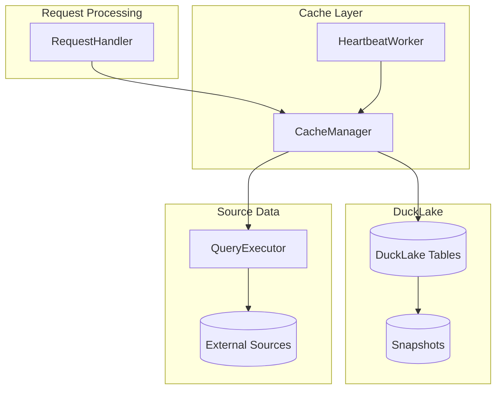
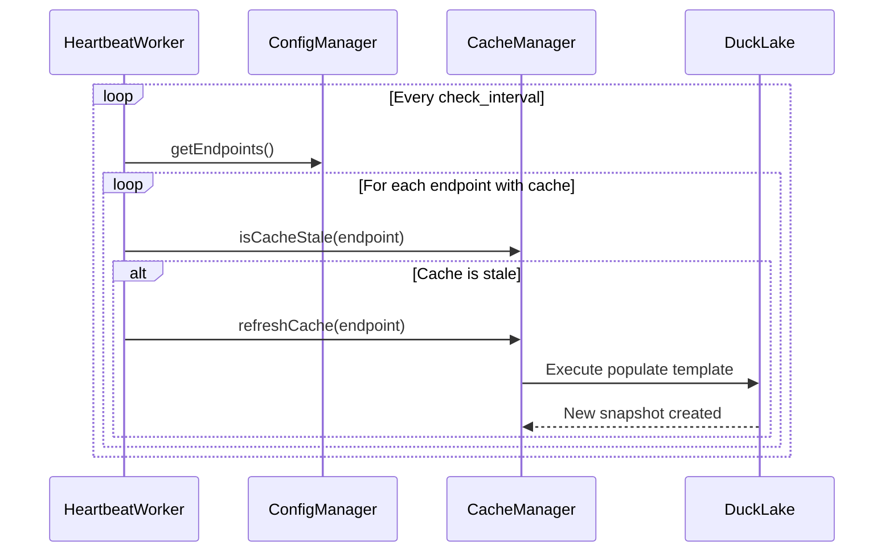
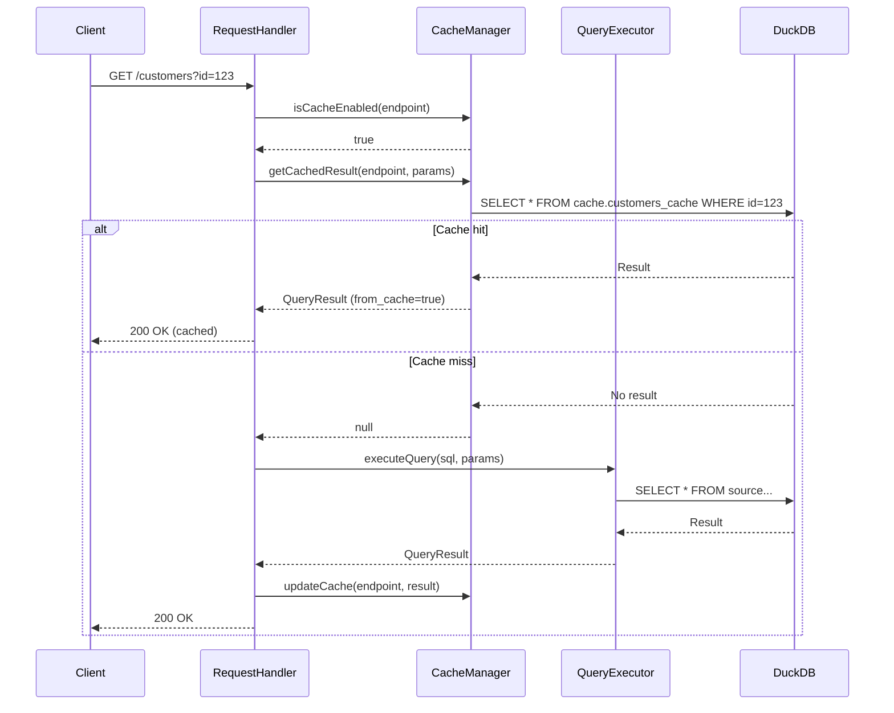

# Caching System

This document describes the DuckLake-based caching architecture in flAPI.

## Overview

flAPI uses DuckLake for result caching, providing:
- Snapshot-based table versioning
- Time-travel queries for rollback
- Efficient incremental refresh
- Scheduled background refresh

## Architecture



## CacheManager

`CacheManager` (src/cache_manager.cpp) handles all cache operations.

### Key Methods

```cpp
class CacheManager {
public:
    // Check if cache is enabled and valid
    bool isCacheEnabled(const EndpointConfig& endpoint) const;
    bool isCacheValid(const EndpointConfig& endpoint) const;

    // Cache operations
    QueryResult getCachedResult(const EndpointConfig& endpoint,
                                const std::map<std::string, std::string>& params);
    void updateCache(const EndpointConfig& endpoint, const QueryResult& result);
    bool invalidateCache(const EndpointConfig& endpoint);

    // Refresh operations
    void refreshCache(const EndpointConfig& endpoint);
    void refreshAllCaches();

    // Snapshot management
    std::vector<SnapshotInfo> getSnapshots(const std::string& table) const;
    void pruneSnapshots(const std::string& table, const RetentionConfig& retention);
};
```

## Cache Configuration

### Endpoint Cache Config

```yaml
cache:
  enabled: true
  table: customers_cache       # Cache table name
  schema: cache                # Schema (default: cache)
  schedule: "1h"               # Refresh interval
  primary-key: [id]            # For merge operations
  cursor:
    column: updated_at         # Change tracking column
    type: timestamp
  retention:
    keep_last_snapshots: 10    # Max snapshots to keep
    max_snapshot_age: "7d"     # Max age of snapshots
  invalidate_on_write: true    # Clear on write operations
  refresh_on_write: false      # Refresh after writes
```

### Global DuckLake Config

```yaml
ducklake:
  enabled: true
  alias: cache                 # Database alias
  metadata_path: ./cache/metadata
  data_path: ./cache/data
  retention:
    keep_last_snapshots: 100
    max_snapshot_age: "30d"
  compaction:
    enabled: true
    schedule: "24h"
  scheduler:
    enabled: true
    scan_interval: "1m"
```

## Cache Modes

### Full Refresh

Replaces entire cache table on each refresh:

```sql
-- Cache populate template (full refresh)
CREATE OR REPLACE TABLE {{cache.schema}}.{{cache.table}} AS
SELECT * FROM read_parquet('{{{ conn.path }}}')
```

**Use when:**
- Small datasets
- Complete data replacement needed
- Simple implementation preferred

### Incremental Append

Adds new rows since last refresh:

```sql
-- Cache populate template (incremental append)
INSERT INTO {{cache.schema}}.{{cache.table}}
SELECT * FROM source_table
{{#cache.previousSnapshotTimestamp}}
WHERE created_at > TIMESTAMP '{{cache.previousSnapshotTimestamp}}'
{{/cache.previousSnapshotTimestamp}}
```

**Use when:**
- Append-only data (logs, events)
- Large datasets
- Fast refresh needed

### Incremental Merge

Handles inserts, updates, and deletes:

```sql
-- Cache populate template (incremental merge)
MERGE INTO {{cache.schema}}.{{cache.table}} AS target
USING (
    SELECT * FROM source_table
    {{#cache.previousSnapshotTimestamp}}
    WHERE updated_at > TIMESTAMP '{{cache.previousSnapshotTimestamp}}'
    {{/cache.previousSnapshotTimestamp}}
) AS source
ON target.id = source.id
WHEN MATCHED THEN UPDATE SET *
WHEN NOT MATCHED THEN INSERT *
```

**Use when:**
- Data changes frequently
- Need to track updates/deletes
- Complex change detection needed

## Cache Template Variables

| Variable | Description |
|----------|-------------|
| `{{cache.table}}` | Cache table name |
| `{{cache.schema}}` | Cache schema name |
| `{{cache.catalog}}` | Cache catalog (DuckLake alias) |
| `{{cache.previousSnapshotTimestamp}}` | Last refresh timestamp |
| `{{cache.currentSnapshotTimestamp}}` | Current refresh timestamp |

## HeartbeatWorker

`HeartbeatWorker` (src/heartbeat_worker.cpp) runs background cache refresh.

### Initialization

```cpp
class HeartbeatWorker {
public:
    HeartbeatWorker(std::shared_ptr<ConfigManager> config_manager,
                    std::shared_ptr<CacheManager> cache_manager);

    void start();
    void stop();

private:
    void workerLoop();
    void checkAndRefreshCaches();

    std::thread worker_thread;
    std::atomic<bool> running;
    std::chrono::seconds check_interval;
};
```

### Refresh Logic



### Schedule Parsing

```cpp
// Parses interval strings like "1h", "30m", "6h"
std::chrono::seconds CacheConfig::getRefreshTimeInSeconds() const {
    return TimeInterval::parseInterval(schedule.value_or("1h"));
}
```

Supported formats:
- `30s` - 30 seconds
- `5m` - 5 minutes
- `1h` - 1 hour
- `24h` - 24 hours

## Snapshot Management

### Creating Snapshots

```sql
-- DuckLake creates snapshot automatically on data changes
INSERT INTO cache.customers_cache SELECT ...;
-- New snapshot created with timestamp
```

### Time-Travel Queries

```sql
-- Query specific snapshot
SELECT * FROM cache.customers_cache
AS OF TIMESTAMP '2024-01-15 10:30:00';

-- Query by snapshot version
SELECT * FROM cache.customers_cache VERSION AS OF 5;
```

### Snapshot Pruning

```cpp
void pruneSnapshots(const std::string& table, const RetentionConfig& retention) {
    if (retention.keep_last_snapshots.has_value()) {
        // Keep only last N snapshots
        deleteOldSnapshots(table, *retention.keep_last_snapshots);
    }
    if (retention.max_snapshot_age.has_value()) {
        // Delete snapshots older than max age
        deleteSnapshotsOlderThan(table, *retention.max_snapshot_age);
    }
}
```

## Cache Invalidation

Caches can be invalidated:

### On Write Operations

```yaml
cache:
  invalidate_on_write: true  # Clear cache after writes
  refresh_on_write: true     # Or immediately refresh
```

### Via API

```bash
# Force cache refresh
POST /api/v1/_config/endpoints/{path}/cache/refresh

# Invalidate cache (next request will refresh)
DELETE /api/v1/_config/endpoints/{path}/cache
```

### Programmatic

```cpp
cache_manager->invalidateCache(endpoint);
```

## Request Flow with Cache



## Source Files

| File | Purpose |
|------|---------|
| `src/cache_manager.cpp` | Cache operations |
| `src/heartbeat_worker.cpp` | Background refresh scheduler |
| `src/include/config_manager.hpp` | CacheConfig, DuckLakeConfig structs |

## Related Documentation

- [DESIGN_DECISIONS.md](../DESIGN_DECISIONS.md#5-ducklake-for-caching) - Why DuckLake
- [query-execution.md](./query-execution.md) - Query execution details
