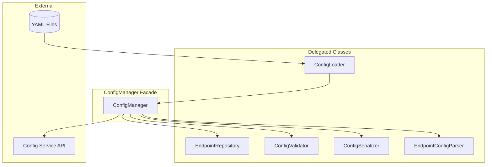
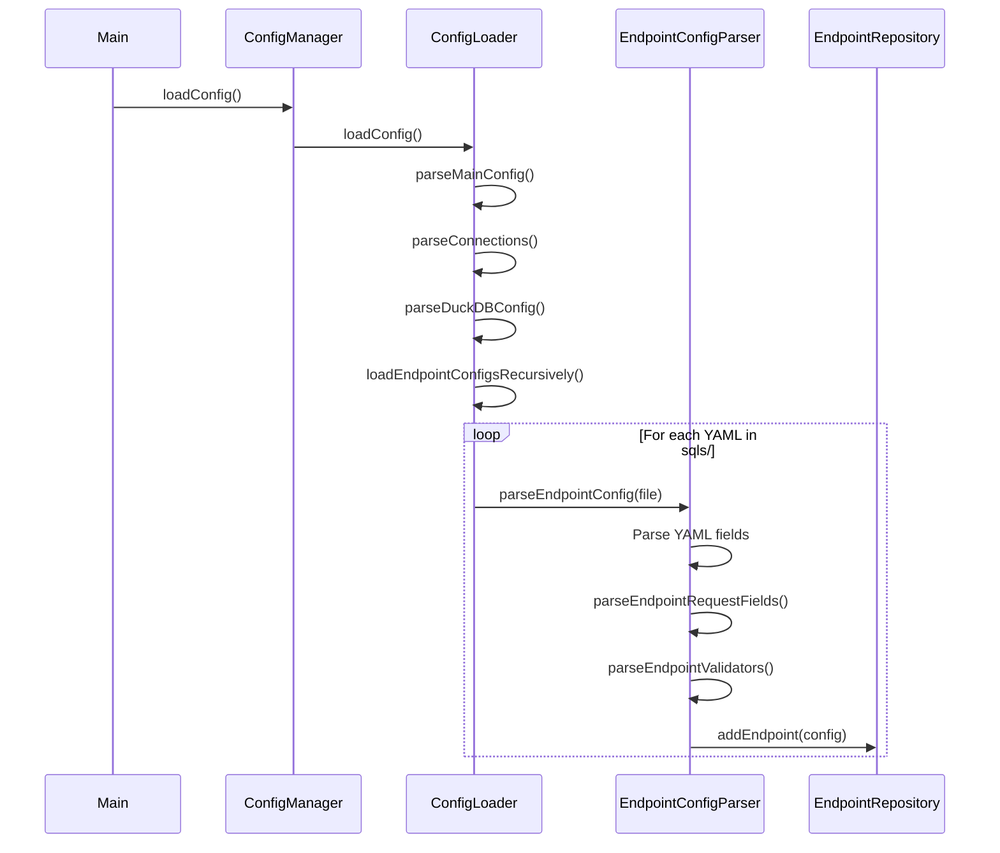

# Configuration System

This document describes the configuration management architecture in flAPI.

## Overview

The configuration system is responsible for:
- Loading and parsing YAML configuration files
- Discovering endpoints in the `sqls/` directory
- Validating configuration against schema rules
- Providing runtime access to configuration values
- Serializing configurations for API responses

## Architecture



## ConfigManager Facade

`ConfigManager` (src/config_manager.cpp) acts as the primary interface for all configuration operations. It delegates to specialized classes:

```cpp
class ConfigManager {
    // Delegated classes (Facade pattern)
    std::unique_ptr<ConfigLoader> config_loader;
    std::unique_ptr<EndpointRepository> endpoint_repository;
    std::unique_ptr<ConfigValidator> config_validator;
    std::unique_ptr<ConfigSerializer> config_serializer;

public:
    // Unified API
    void loadConfig();
    const EndpointConfig* getEndpointForPath(const std::string& path) const;
    ValidationResult validateEndpointConfig(const EndpointConfig& config) const;
    crow::json::wvalue serializeEndpointConfig(const EndpointConfig& config) const;
};
```

## Delegated Classes

### ConfigLoader (src/config_loader.cpp)

Responsible for loading YAML files from disk:

- Loads main `flapi.yaml` configuration
- Recursively scans `sqls/` directory for endpoint configs
- Resolves relative paths to absolute paths
- Handles environment variable substitution (`${VAR_NAME}`)

**Key methods:**
```cpp
void loadConfig();
void loadEndpointConfigsRecursively(const std::filesystem::path& dir);
void loadEndpointConfig(const std::string& config_file);
```

### EndpointRepository (src/endpoint_repository.cpp)

Manages the collection of loaded endpoints:

- Stores endpoints in a vector
- Provides lookup by URL path, slug, or MCP name
- Handles endpoint add/remove/replace operations

**Key methods:**
```cpp
const EndpointConfig* getEndpointForPath(const std::string& path) const;
const EndpointConfig* getEndpointForPathAndMethod(const std::string& path, const std::string& method) const;
void addEndpoint(const EndpointConfig& endpoint);
bool removeEndpointByPath(const std::string& path);
```

### ConfigValidator (src/config_validator.cpp)

Validates configuration against rules:

- Required field validation
- Type validation
- Reference validation (connections, templates)
- Custom validator rules

**Key methods:**
```cpp
ValidationResult validateEndpointConfig(const EndpointConfig& config) const;
ValidationResult validateEndpointConfigFromYaml(const std::string& yaml_content) const;
```

**Validation Result:**
```cpp
struct ValidationResult {
    bool valid;
    std::vector<std::string> errors;
    std::vector<std::string> warnings;
};
```

### ConfigSerializer (src/config_serializer.cpp)

Handles serialization to/from different formats:

- JSON serialization for API responses
- YAML serialization for file export
- Supports both hyphen-case and camelCase styles

**Key methods:**
```cpp
crow::json::wvalue serializeEndpointConfig(const EndpointConfig& config, EndpointJsonStyle style) const;
EndpointConfig deserializeEndpointConfig(const crow::json::rvalue& json) const;
std::string serializeEndpointConfigToYaml(const EndpointConfig& config) const;
```

### EndpointConfigParser (src/endpoint_config_parser.cpp)

Parses endpoint YAML into `EndpointConfig` structs:

- Parses request field definitions
- Parses validator configurations
- Parses cache, auth, and rate limit settings
- Handles MCP-specific fields

**Key methods:**
```cpp
void parseEndpointConfig(const std::filesystem::path& config_file);
void parseEndpointRequestFields(const YAML::Node& endpoint_config, EndpointConfig& endpoint);
void parseEndpointValidators(const YAML::Node& req, RequestFieldConfig& field);
```

## Configuration Loading Flow



## Key Configuration Structures

### Main Configuration (flapi.yaml)

```yaml
project-name: my-project
server:
  port: 8080
connections:
  my-data:
    properties:
      path: ./data/file.parquet
duckdb:
  db_path: ./cache.db
  threads: 4
template:
  path: ./sqls
  environment-whitelist:
    - DB_.*
    - API_KEY
```

### Endpoint Configuration (sqls/*.yaml)

```yaml
url-path: /customers
method: GET
request:
  - field-name: id
    field-in: query
    required: false
    validators:
      - type: int
        min: 1
template-source: customers.sql
connection: [my-data]
cache:
  enabled: true
  table: customers_cache
  schedule: "1h"
auth:
  required: true
  roles: [admin, user]
```

### EndpointConfig Struct

```cpp
struct EndpointConfig {
    std::string urlPath;
    std::string method;
    std::vector<RequestFieldConfig> request_fields;
    std::string templateSource;
    std::vector<std::string> connection;
    CacheConfig cache;
    AuthConfig auth;
    RateLimitConfig rate_limit;
    OperationConfig operation;

    // MCP-specific (optional)
    std::optional<MCPToolInfo> mcp_tool;
    std::optional<MCPResourceInfo> mcp_resource;
    std::optional<MCPPromptInfo> mcp_prompt;

    // Helper methods
    Type getType() const;
    std::string getName() const;
    std::string getSlug() const;
};
```

## Runtime Configuration Updates

The ConfigService API allows runtime configuration changes:

```
POST /api/v1/_config/endpoints     - Create endpoint
PUT  /api/v1/_config/endpoints/:path - Update endpoint
DELETE /api/v1/_config/endpoints/:path - Delete endpoint
```

These operations:
1. Validate the new configuration
2. Update the EndpointRepository
3. Optionally persist to disk

## Path Resolution

Paths are resolved relative to the base configuration directory:

```cpp
std::string makePathRelativeToBasePathIfNecessary(const std::string& value) const {
    std::filesystem::path path(value);
    if (path.is_relative()) {
        return (base_path / path).string();
    }
    return value;
}
```

## Environment Variable Substitution

Environment variables in configuration are substituted at load time:

```yaml
connections:
  db:
    properties:
      password: ${DB_PASSWORD}  # Replaced with env value
```

Variables must be whitelisted:
```yaml
template:
  environment-whitelist:
    - DB_.*
    - API_.*
```

## Source Files

| File | Purpose |
|------|---------|
| `src/config_manager.cpp` | Facade implementation |
| `src/config_loader.cpp` | YAML loading |
| `src/endpoint_config_parser.cpp` | Endpoint parsing |
| `src/endpoint_repository.cpp` | Endpoint storage |
| `src/config_validator.cpp` | Validation rules |
| `src/config_serializer.cpp` | Serialization |
| `src/include/config_manager.hpp` | Struct definitions |

## Related Documentation

- [DESIGN_DECISIONS.md](../DESIGN_DECISIONS.md#2-facade-pattern-for-configmanager) - Why facade pattern
- [../CONFIG_REFERENCE.md](../../CONFIG_REFERENCE.md) - Configuration options
