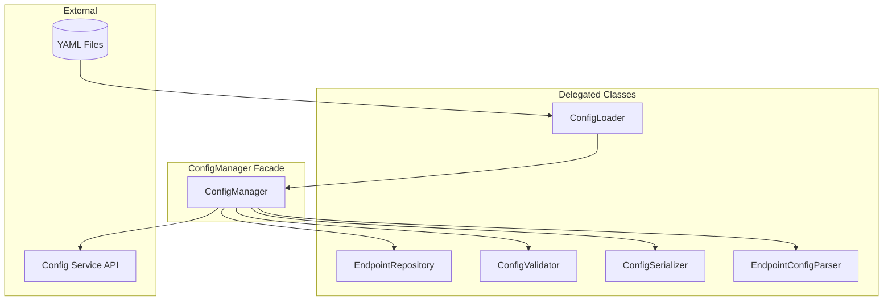
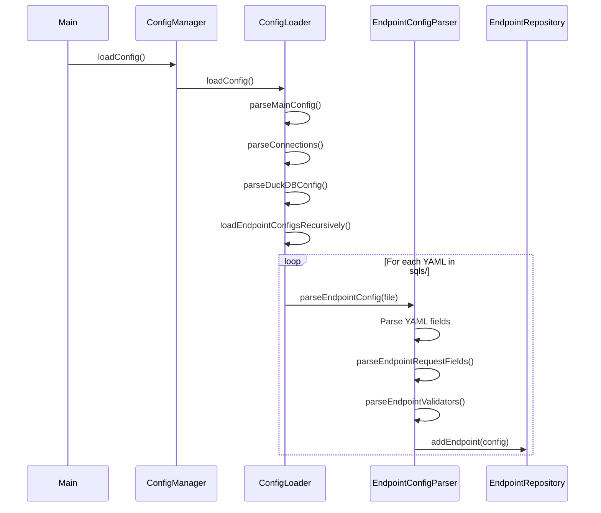

# Configuration System

This document describes the configuration management architecture in flAPI.

## Overview

The configuration system is responsible for:
- Loading and parsing YAML configuration files
- Discovering endpoints in the `sqls/` directory
- Validating configuration against schema rules
- Providing runtime access to configuration values
- Serializing configurations for API responses

## Architecture


```mermaid
graph TB
    subgraph "ConfigManager Facade"
        CM[ConfigManager]
    end

    subgraph "Delegated Classes"
        CL[ConfigLoader]
        ER[EndpointRepository]
        CV[ConfigValidator]
        CS[ConfigSerializer]
        ECP[EndpointConfigParser]
    end

    subgraph "External"
        YAML[(YAML Files)]
        API[Config Service API]
    end

    YAML --> CL
    CL --> CM
    CM --> ER
    CM --> CV
    CM --> CS
    CM --> ECP
    CM --> API
```

## ConfigManager Facade

`ConfigManager` (src/config_manager.cpp) acts as the primary interface for all configuration operations. It delegates to specialized classes:

```cpp
class ConfigManager {
    // Delegated classes (Facade pattern)
    std::unique_ptr<ConfigLoader> config_loader;
    std::unique_ptr<EndpointRepository> endpoint_repository;
    std::unique_ptr<ConfigValidator> config_validator;
    std::unique_ptr<ConfigSerializer> config_serializer;

public:
    // Unified API
    void loadConfig();
    EndpointRef getEndpointForPath(const std::string& path) const;
    ValidationResult validateEndpointConfig(const EndpointConfig& config) const;
    crow::json::wvalue serializeEndpointConfig(const EndpointConfig& config) const;
};
```

### Copy-on-write endpoint table

Endpoint lookups do **not** return a raw pointer into a live `std::vector`. They
return an `EndpointRef`: a pinned `shared_ptr` to an immutable snapshot, plus a
pointer into it.

```cpp
// A reload clones, mutates and publishes a new snapshot. Readers holding the
// previous one keep seeing a consistent table until they release it.
std::shared_ptr<const std::vector<EndpointConfig>> endpoints_snapshot;
```

This fixed a real use-after-free: the vector was cleared and re-`push_back`-ed at
runtime by `refreshConfig` and the config-service routes, with no lock against
in-flight requests, while handlers held raw pointers into it.

> **`EndpointRef` is `[[nodiscard]]` and must be bound to a named variable.**
> Used as a temporary, the snapshot releases at the end of the full expression
> and the pointer dangles — reintroducing exactly the bug it exists to prevent.
>
> ```cpp
> const auto endpoint = cfg->getEndpointForPathAndMethod(path, method);  // good
> auto* p = cfg->getEndpointForPathAndMethod(path, method).get();        // dangles
> ```

It is also the precondition that makes `RequestContext`'s `string_view` fields
safe to hold for the life of a request. See
[observability.md](./observability.md).


## Delegated Classes

### ConfigLoader (src/config_loader.cpp)

Responsible for loading YAML files from disk:

- Loads main `flapi.yaml` configuration
- Recursively scans `sqls/` directory for endpoint configs
- Resolves relative paths to absolute paths
- Handles environment variable substitution (`${VAR_NAME}`)

**Key methods:**
```cpp
void loadConfig();
void loadEndpointConfigsRecursively(const std::filesystem::path& dir);
void loadEndpointConfig(const std::string& config_file);
```

### EndpointRepository (src/endpoint_repository.cpp)

Manages the collection of loaded endpoints:

- Stores endpoints in a vector
- Provides lookup by URL path, slug, or MCP name
- Handles endpoint add/remove/replace operations

**Key methods:**
```cpp
const EndpointConfig* getEndpointForPath(const std::string& path) const;
const EndpointConfig* getEndpointForPathAndMethod(const std::string& path, const std::string& method) const;
void addEndpoint(const EndpointConfig& endpoint);
bool removeEndpointByPath(const std::string& path);
```

### ConfigValidator (src/config_validator.cpp)

Validates configuration against rules:

- Required field validation
- Type validation
- Reference validation (connections, templates)
- Custom validator rules

**Key methods:**
```cpp
ValidationResult validateEndpointConfig(const EndpointConfig& config) const;
ValidationResult validateEndpointConfigFromYaml(const std::string& yaml_content) const;
```

**Validation Result:**
```cpp
struct ValidationResult {
    bool valid;
    std::vector<std::string> errors;
    std::vector<std::string> warnings;
};
```

### ConfigSerializer (src/config_serializer.cpp)

Handles serialization to/from different formats:

- JSON serialization for API responses
- YAML serialization for file export
- Supports both hyphen-case and camelCase styles

**Key methods:**
```cpp
crow::json::wvalue serializeEndpointConfig(const EndpointConfig& config, EndpointJsonStyle style) const;
EndpointConfig deserializeEndpointConfig(const crow::json::rvalue& json) const;
std::string serializeEndpointConfigToYaml(const EndpointConfig& config) const;
```

### EndpointConfigParser (src/endpoint_config_parser.cpp)

Parses endpoint YAML into `EndpointConfig` structs:

- Parses request field definitions
- Parses validator configurations
- Parses cache, auth, and rate limit settings
- Handles MCP-specific fields

**Key methods:**
```cpp
void parseEndpointConfig(const std::filesystem::path& config_file);
void parseEndpointRequestFields(const YAML::Node& endpoint_config, EndpointConfig& endpoint);
void parseEndpointValidators(const YAML::Node& req, RequestFieldConfig& field);
```

## Configuration Loading Flow


```mermaid
sequenceDiagram
    participant Main
    participant CM as ConfigManager
    participant CL as ConfigLoader
    participant ECP as EndpointConfigParser
    participant ER as EndpointRepository

    Main->>CM: loadConfig()
    CM->>CL: loadConfig()
    CL->>CL: parseMainConfig()
    CL->>CL: parseConnections()
    CL->>CL: parseDuckDBConfig()
    CL->>CL: loadEndpointConfigsRecursively()

    loop For each YAML in sqls/
        CL->>ECP: parseEndpointConfig(file)
        ECP->>ECP: Parse YAML fields
        ECP->>ECP: parseEndpointRequestFields()
        ECP->>ECP: parseEndpointValidators()
        ECP->>ER: addEndpoint(config)
    end
```

## Key Configuration Structures

### Main Configuration (flapi.yaml)

```yaml
project-name: my-project
server:
  port: 8080
connections:
  my-data:
    properties:
      path: ./data/file.parquet
duckdb:
  db_path: ./cache.db
  threads: 4
template:
  path: ./sqls
  environment-whitelist:
    - DB_.*
    - API_KEY
log-level: info          # read from YAML; CLI > env > YAML > default
log-format: json
audit:
  enabled: true
  sink: file
  path: /var/log/flapi/audit.jsonl
  redact: [password, tax_id]
tracing:                 # see below - parsed once, at startup
  enabled: false
```

#### The `tracing:` block

Parsed by `ConfigManager::parseTracingConfig()` into `TracingConfig`
(`src/include/tracing_config.hpp`). Every key is **boot-only**: the provider,
capture policy and middleware snapshots are all taken once at startup, so a
reload does not affect them.

Optional fields are held as `std::optional` on purpose. A YAML *default* must not
be indistinguishable from an operator's explicit setting, or the exporter would
silently overwrite an injected `OTEL_EXPORTER_OTLP_ENDPOINT` and Kubernetes
auto-instrumentation would break.

The full key list, defaults and semantics live in
[../../OBSERVABILITY.md § 2](../../OBSERVABILITY.md#2-turning-tracing-on).

Per-endpoint, `mcp-tool.tracing.capture` overrides the global tier in either
direction — except that a global `off` always wins.

### Endpoint Configuration (sqls/*.yaml)

```yaml
url-path: /customers
method: GET
request:
  - field-name: id
    field-in: query
    required: false
    validators:
      - type: int
        min: 1
template-source: customers.sql
connection: [my-data]
cache:
  enabled: true
  table: customers_cache
  schedule: "1h"
auth:
  required: true
  roles: [admin, user]
```

### EndpointConfig Struct

```cpp
struct EndpointConfig {
    std::string urlPath;
    std::string method;
    std::vector<RequestFieldConfig> request_fields;
    std::string templateSource;
    std::vector<std::string> connection;
    CacheConfig cache;
    AuthConfig auth;
    RateLimitConfig rate_limit;
    OperationConfig operation;

    // MCP-specific (optional)
    std::optional<MCPToolInfo> mcp_tool;
    std::optional<MCPResourceInfo> mcp_resource;
    std::optional<MCPPromptInfo> mcp_prompt;

    // Helper methods
    Type getType() const;
    std::string getName() const;
    std::string getSlug() const;
};
```

## Runtime Configuration Updates

The ConfigService API allows runtime configuration changes:

```
POST /api/v1/_config/endpoints     - Create endpoint
PUT  /api/v1/_config/endpoints/:path - Update endpoint
DELETE /api/v1/_config/endpoints/:path - Delete endpoint
```

These operations:
1. Validate the new configuration
2. Update the EndpointRepository
3. Optionally persist to disk

## Path Resolution

Paths are resolved relative to the base configuration directory:

```cpp
std::string makePathRelativeToBasePathIfNecessary(const std::string& value) const {
    std::filesystem::path path(value);
    if (path.is_relative()) {
        return (base_path / path).string();
    }
    return value;
}
```

## Environment Variable Substitution

Environment variables in configuration are substituted at load time:

```yaml
connections:
  db:
    properties:
      password: ${DB_PASSWORD}  # Replaced with env value
```

Variables must be whitelisted:
```yaml
template:
  environment-whitelist:
    - DB_.*
    - API_.*
```

## Source Files

| File | Purpose |
|------|---------|
| `src/config_manager.cpp` | Facade implementation |
| `src/config_loader.cpp` | YAML loading |
| `src/endpoint_config_parser.cpp` | Endpoint parsing |
| `src/endpoint_repository.cpp` | Endpoint storage |
| `src/config_validator.cpp` | Validation rules |
| `src/config_serializer.cpp` | Serialization |
| `src/include/config_manager.hpp` | Struct definitions, `EndpointRef`, snapshot |
| `src/tracing_config.cpp` | The boot-only `tracing:` block |

## Related Documentation

- [DESIGN_DECISIONS.md](../DESIGN_DECISIONS.md#2-facade-pattern-for-configmanager) - Why facade pattern
- [../../CONFIG_REFERENCE.md](../../CONFIG_REFERENCE.md) - Configuration options
- [DESIGN_DECISIONS.md](../DESIGN_DECISIONS.md#10e-copy-on-write-endpoint-table) - Why copy-on-write
- [observability.md](./observability.md) - What depends on the pinned snapshot
