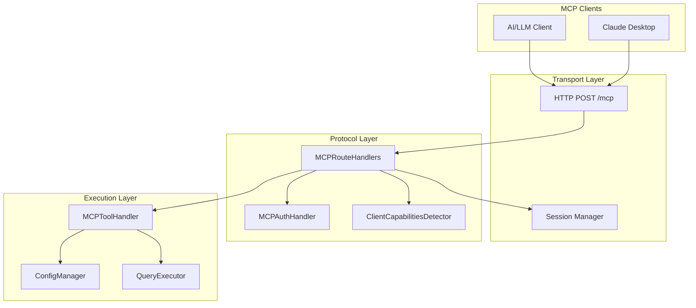
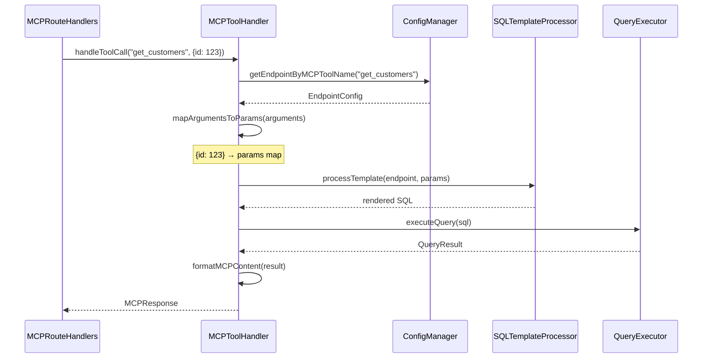

# MCP Protocol Implementation

This document describes the Model Context Protocol (MCP) server implementation in flAPI.

## Overview

flAPI implements MCP to expose endpoints as AI-consumable tools:
- JSON-RPC 2.0 transport over HTTP
- Tools, Resources, and Prompts primitives
- Session management for stateful interactions
- Authentication via Bearer tokens or OIDC

## Architecture



## MCPRouteHandlers

`MCPRouteHandlers` (src/mcp_route_handlers.cpp) handles all MCP JSON-RPC requests.

### Route Registration

```cpp
void registerRoutes(crow::App<...>& app, int port) {
    // Main JSON-RPC endpoint
    CROW_ROUTE(app, "/mcp").methods("POST"_method)
        ([this](const crow::request& req) {
            return handleMCPRequest(req);
        });

    // Health check
    CROW_ROUTE(app, "/mcp/health").methods("GET"_method)
        ([this](const crow::request& req) {
            return handleHealth(req);
        });
}
```

### Request Processing Flow

```cpp
crow::response handleMCPRequest(const crow::request& req) {
    // 1. Parse JSON-RPC request
    auto mcp_request = parseMCPRequest(req);
    if (!mcp_request) {
        return createJsonRpcErrorResponse("-32700", "Parse error");
    }

    // 2. Validate authentication
    if (!auth_handler_->validateAuth(req)) {
        return createJsonRpcErrorResponse("-32001", "Authentication failed");
    }

    // 3. Get or create session
    auto session_id = extractSessionIdFromRequest(req);
    if (!session_id) {
        session_id = session_manager_->createSession();
    }

    // 4. Dispatch to handler
    auto response = dispatchMCPRequest(*mcp_request, req);

    // 5. Return JSON-RPC response
    return createJsonRpcResponse(*mcp_request, response, session_id);
}
```

### Method Dispatch

```cpp
MCPResponse dispatchMCPRequest(const MCPRequest& request, const crow::request& http_req) {
    const auto& method = request.method;

    if (method == "initialize") return handleInitializeRequest(request, http_req);
    if (method == "tools/list") return handleToolsListRequest(request, http_req);
    if (method == "tools/call") return handleToolsCallRequest(request, http_req);
    if (method == "resources/list") return handleResourcesListRequest(request, http_req);
    if (method == "resources/read") return handleResourcesReadRequest(request, http_req);
    if (method == "prompts/list") return handlePromptsListRequest(request, http_req);
    if (method == "prompts/get") return handlePromptsGetRequest(request, http_req);
    if (method == "ping") return handlePingRequest(request, http_req);

    // Method not found
    MCPResponse response;
    response.error = formatJsonRpcError(-32601, "Method not found");
    return response;
}
```

## MCP Methods

### initialize

Protocol handshake and capability negotiation:

```json
// Request
{
  "jsonrpc": "2.0",
  "method": "initialize",
  "params": {
    "protocolVersion": "2024-11-05",
    "capabilities": {
      "tools": {},
      "resources": {}
    },
    "clientInfo": {
      "name": "claude-desktop",
      "version": "1.0.0"
    }
  },
  "id": 1
}

// Response
{
  "jsonrpc": "2.0",
  "result": {
    "protocolVersion": "2024-11-05",
    "capabilities": {
      "tools": { "listChanged": true },
      "resources": { "listChanged": true },
      "prompts": { "listChanged": true }
    },
    "serverInfo": {
      "name": "flapi-mcp-server",
      "version": "0.1.0"
    }
  },
  "id": 1
}
```

### tools/list

Lists available tools derived from endpoint configurations:

```json
// Response
{
  "jsonrpc": "2.0",
  "result": {
    "tools": [
      {
        "name": "get_customers",
        "description": "Retrieve customer data",
        "inputSchema": {
          "type": "object",
          "properties": {
            "id": { "type": "integer", "description": "Customer ID" },
            "limit": { "type": "integer", "description": "Max results" }
          }
        }
      }
    ]
  },
  "id": 2
}
```

### tools/call

Executes a tool (endpoint):

```json
// Request
{
  "jsonrpc": "2.0",
  "method": "tools/call",
  "params": {
    "name": "get_customers",
    "arguments": {
      "id": 123,
      "limit": 10
    }
  },
  "id": 3
}

// Response
{
  "jsonrpc": "2.0",
  "result": {
    "content": [
      {
        "type": "text",
        "text": "[{\"id\": 123, \"name\": \"Alice\"}]"
      }
    ]
  },
  "id": 3
}
```

## MCPToolHandler

`MCPToolHandler` (src/mcp_tool_handler.cpp) executes tool calls.

### Tool Execution Flow



### Argument to Parameter Mapping

```cpp
std::map<std::string, std::string> mapArgumentsToParams(
    const EndpointConfig& endpoint,
    const crow::json::wvalue& arguments) {

    std::map<std::string, std::string> params;

    for (const auto& field : endpoint.request_fields) {
        if (arguments.has(field.fieldName)) {
            params[field.fieldName] = arguments[field.fieldName].dump();
        } else if (!field.defaultValue.empty()) {
            params[field.fieldName] = field.defaultValue;
        }
    }

    return params;
}
```

## Unified Configuration

Endpoints can serve both REST and MCP:

```yaml
# sqls/customers.yaml
url-path: /customers
method: GET
request:
  - field-name: id
    field-in: query
    required: false
template-source: customers.sql
connection: [my-data]

# MCP tool definition (optional)
mcp-tool:
  name: get_customers
  description: Retrieve customer information by ID
```

### MCP-Only Entities

Entities can be MCP-only (no REST endpoint):

```yaml
# sqls/customer_lookup.yaml (MCP tool only)
mcp-tool:
  name: customer_lookup
  description: Look up customer by various criteria

request:
  - field-name: query
    description: Search query
template-source: customer_lookup.sql
connection: [my-data]
```

## Session Management

`MCPSessionManager` (src/mcp_session_manager.cpp) tracks client sessions.

### Session ID Header

```
Mcp-Session-Id: abc123
```

### Session State

```cpp
struct MCPSession {
    std::string session_id;
    std::chrono::time_point<std::chrono::steady_clock> created_at;
    std::chrono::time_point<std::chrono::steady_clock> last_accessed;
    crow::json::wvalue client_capabilities;
    crow::json::wvalue client_info;
};
```

## Authentication

`MCPAuthHandler` (src/mcp_auth_handler.cpp) validates MCP requests.

### Configuration

```yaml
mcp:
  enabled: true
  port: 8081
  auth:
    enabled: true
    type: bearer           # or "basic", "oidc"
    jwt_secret: ${JWT_SECRET}
    jwt_issuer: flapi
    methods:
      tools/call:
        required: true
      resources/read:
        required: false    # Read-only, no auth
```

### Per-Method Auth

```cpp
bool validateAuth(const crow::request& req, const std::string& method) {
    auto& method_config = auth_config_.methods[method];
    if (!method_config.required) {
        return true;  // Auth not required for this method
    }
    return validateToken(req);
}
```

## Client Capabilities

`MCPClientCapabilitiesDetector` (src/mcp_client_capabilities.cpp) adapts responses based on client.

### Capability Detection

```cpp
struct ClientCapabilities {
    bool supports_streaming = false;
    bool supports_progress = false;
    bool supports_cancellation = false;
    std::string client_name;
    std::string client_version;
};

ClientCapabilities detectCapabilities(const crow::json::wvalue& init_params) {
    ClientCapabilities caps;
    if (init_params.has("capabilities")) {
        auto& client_caps = init_params["capabilities"];
        // Parse client capabilities
    }
    return caps;
}
```

## MCP Server Configuration

```yaml
# flapi.yaml
mcp:
  enabled: true
  port: 8081
  instructions: |
    This MCP server provides access to customer data.
    Use the get_customers tool to query the database.
  instructions_file: ./mcp_instructions.md  # Alternative
  auth:
    enabled: true
    type: bearer
```

## JSON-RPC Error Codes

| Code | Meaning | When Used |
|------|---------|-----------|
| -32700 | Parse error | Invalid JSON |
| -32600 | Invalid request | Missing required fields |
| -32601 | Method not found | Unknown method |
| -32602 | Invalid params | Missing/invalid arguments |
| -32603 | Internal error | Server error |
| -32001 | Authentication error | Auth failed |
| -32002 | Tool not found | Unknown tool name |

## Source Files

| File | Purpose |
|------|---------|
| `src/mcp_route_handlers.cpp` | Main request handling |
| `src/mcp_tool_handler.cpp` | Tool execution |
| `src/mcp_session_manager.cpp` | Session state |
| `src/mcp_auth_handler.cpp` | Authentication |
| `src/mcp_client_capabilities.cpp` | Client detection |
| `src/include/mcp_types.hpp` | Type definitions |
| `src/include/mcp_constants.hpp` | Protocol constants |

## Related Documentation

- [DESIGN_DECISIONS.md](../DESIGN_DECISIONS.md#7-json-rpc-for-mcp-transport) - Why JSON-RPC
- [DESIGN_DECISIONS.md](../DESIGN_DECISIONS.md#3-unified-restmcp-configuration) - Unified config
- [../../MCP_REFERENCE.md](../../MCP_REFERENCE.md) - MCP API reference
