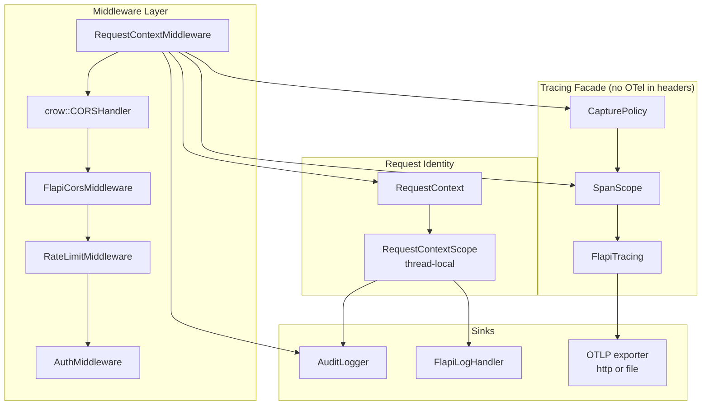

# Observability

This document describes how flAPI produces traces, audit records and correlated
logs from one shared request identity.

For configuration and operational guidance, see
[OBSERVABILITY.md](../../OBSERVABILITY.md). This document is about the
implementation.

## Overview

Three outputs — an OpenTelemetry span tree, an audit JSONL record, and
application log lines — all derive from a single `RequestContext` created in the
first middleware. That is the whole design:

- **One identity.** A server-minted request id, plus trace and span ids when a
  trace exists, shared by all three outputs so they can be joined.
- **One clock.** `RequestContext::t0` is a single `steady_clock` reading. Before
  this, three separate clocks timed overlapping work and disagreed.
- **One span per request, created in the leftmost middleware.** Instrumenting the
  request handler instead would miss every request that never reaches it: 401,
  403, 429, CORS preflights, 404s.

The tracing dependency is quarantined: **no header under `src/include/` includes
an OpenTelemetry header**, and `opentelemetry-cpp` links `PRIVATE` to
`flapi-lib`. See [DESIGN_DECISIONS § 10d](../DESIGN_DECISIONS.md).

## Architecture



## RequestContext

`src/include/request_context.hpp`. One per request, owned **by value** in the
Crow middleware context.

```cpp
std::array<char, 32> trace_id{};    // all-zero == inactive
std::array<char, 16> span_id{};
std::array<char, 20> request_id{};  // "req-" + 16 hex, ALWAYS server-minted
std::chrono::steady_clock::time_point t0;
std::string_view raw_path;          // NEVER exported
std::string_view route_template;    // "<unmatched>" until resolved
```

Two deliberate choices:

- **Fixed-width `std::array`, not `std::string`.** 32 and 16 hex characters both
  exceed libstdc++'s 15-byte small-string buffer, so `std::string` would mean a
  heap allocation per request on every route — including `/health`. (Note
  libc++'s buffer is 22 bytes, which is why the allocation-budget test measures
  capacity rather than assuming a number.)
- **`string_view` for paths.** Safe only because the endpoint table is a pinned
  copy-on-write snapshot; see
  [config-system.md](./config-system.md).

### Lifetime and the thread-local scope

`RequestContextScope` makes the context ambient so that ~658 `CROW_LOG_*` call
sites and the inner pipeline can find it **without any signature changes**.

The scope is a **member of the middleware context**, not a local in
`before_handle`. Crow destroys the per-request context on every path, so the
scope's destructor clears the thread-local even when `after_handle` is skipped —
a handler that throws, a short-circuited response, an aborted connection. A
pooled Crow worker must never begin a request with a stale context attached.

> **This ambience does not cross threads.** OpenTelemetry's active-span stack is
> thread-local. `MCPTaskManager`, `HeartbeatWorker`, cache refresh and warmup run
> off-request, where the ambient context is either absent or — worse — stale from
> an unrelated earlier request. **Background threads start root spans and never
> implicit children**, and carry trace context explicitly.

## SpanScope

`src/include/trace_scope.hpp`. An opaque, pointer-sized RAII handle.

```cpp
class SpanScope {
    struct Impl; Impl* impl_ = nullptr;   // sizeof(SpanScope) == sizeof(void*)
};
```

- **Opaque** so that protobuf and abseil stay out of ~80 translation units and
  out of the test binary's link surface.
- **Strict RAII.** The destructor ends the span. Without this, an exception
  thrown between `startSpan` and `end()` would leak the OTel scope push and
  mis-parent the *next* request on that pooled worker.
- **Never throws.** Every method catches internally. Instrumentation may not fail
  a request, including on `bad_alloc` while building an attribute.
- **Falsy and allocation-free when disabled**, so the call-site idiom is
  `if (span) span.setAttr(...)` — guard before building the value.

One subtlety worth knowing: `setAttr` has an explicit `const char*` overload.
Without it, every string literal binds to the `bool` overload and every attribute
exports as `true`.

### The ON/OFF twin

`FLAPI_WITH_TRACING=OFF` compiles `trace_scope_off.cpp` and
`flapi_tracing_off.cpp` instead of their ON counterparts. The two live in
versioned inline namespaces (`tracing_on_v1` / `tracing_off_v1`) and each defines
an out-of-line anchor symbol every call site necessarily references, so a
mixed-macro build **fails to link** rather than corrupting silently. The macro is
defined globally and before `add_subdirectory`, because it changes type layout.

With tracing off you still get: the request id, log correlation, the REST audit
line, and `/api/v1/_config/metrics`.

## Capture tiers

`src/trace_capture_policy.cpp`. Three tiers — `off`, `metadata` (default),
`payload`.

Tier resolution is `effectiveTier()`: a global `off` always wins, giving an
operator one lever guaranteed to stop export; otherwise a per-endpoint setting may
move the tier in either direction.

Values are captured **only** at the payload tier, and only from **declared**
request fields — an arbitrary query parameter a caller appends is not part of the
endpoint's contract.

### Redaction

Two independent denylists, both applied before anything is exported:

1. **Credential stems**, in `src/redaction.cpp`, shared with the audit log. These
   apply at every tier regardless of configuration. Matching is a **substring
   test over a normalised key** (lowercased, `-` and `_` stripped) rather than
   equality, so `auth_token`, `x-api-key` and `user_password` are all caught.
   Stems are chosen long enough not to swallow ordinary field names —
   `authorization` rather than `auth`, so a field called `author` survives.
2. **The operator's `audit.redact` list**, reused rather than duplicated. A second
   list would diverge, and the half somebody forgot to update is the one that
   leaks.

**Redact first, clamp second.** Clamping first can truncate mid-value and leave a
partial secret behind. Truncation walks back over UTF-8 continuation bytes so it
never splits a character.

> The audit log deliberately depends on `redaction.hpp` and **not** on
> `CapturePolicy`: audit records are written even when tracing is compiled out, so
> its redactor cannot live in the tracing layer. That coupling is exactly how the
> audit log once wrote declared `password` fields in cleartext while the span path
> redacted them correctly.

### Bounds

Each value is clamped to `payload.max_value_bytes` (8 KiB default). The payload
object as a whole is additionally bounded by a field count and a total byte
budget, and marked `flapi.truncated` when either is hit — without that, a wide
endpoint could hold *fields × 8 KiB* per span, doubled by the OpenInference
overlay, across a queue of `max_queue_size` spans.

## Trace context

`src/trace_context.cpp` implements W3C Trace Context parsing and
[SEP-414](https://modelcontextprotocol.io/seps/414-request-meta).

- `traceparent` is parsed strictly: version `ff` rejected, all-zero ids rejected,
  length checked, uppercase hex normalised, bounded at 256 bytes.
- `tracestate` and `baggage` are clamped at list-member boundaries.
- **`params._meta` beats the HTTP header.** Over a gateway the HTTP hop is the
  *gateway's* span, while `_meta` carries the agent's. Disagreement is recorded as
  `flapi.trace.context_source = meta_over_header`.
- The SEP-414 keys are **unprefixed** (`traceparent`, not
  `io.modelcontextprotocol/traceparent`). Their constants live in
  `trace_context.hpp` and deliberately **not** in `mcp_constants.hpp` — physical
  separation is what stops a maintainer "fixing" them into the reverse-DNS block.
- `_meta` is parsed **even when tracing is disabled**, because correlation into
  the audit and application logs is useful on its own.

The body peek that finds `_meta` runs in the first middleware, *before* auth and
rate limiting, so it is bounded at 64 KiB rather than the full body limit.

## Bounding what reaches the exporter

Two caller-controlled values would otherwise become span names or metric
dimensions:

- **MCP method** — passed through `knownMcpMethodOrUnknown()`, a whitelist.
- **MCP tool name** — recorded only after the tool resolves against the
  configured endpoints; unknown names collapse to `<unknown_tool>`.

Similarly, `http.route` is always a template or a fixed literal, and every
unmatched path collapses to a single `<unmatched>` bucket. A scanner hitting a
thousand random URLs produces one route label, not a thousand.

Error status is always an **enumerated** `error.type`, never an exception message.

## Export

`src/flapi_tracing.cpp` owns the provider, processor and exporter.

| Exporter | Processor | Notes |
|---|---|---|
| `otlp_http` | `BatchSpanProcessor` | Retry and backoff from the SDK |
| `otlp_file` | Batch, or per-record under `flush.mode: on_response` | The air-gapped topology |

`flush.mode: on_response` is accepted **only** for the file exporter. Flushing a
network export on the request thread would couple p99 latency to the collector's
availability, so it is refused with a warning and falls back to batch.

`Tracing()` is a function-local static, not a leaked singleton, because it owns a
processor thread. A `TracingGuard` in `main()` shuts it down before exit, and the
signal path force-flushes with a fixed 2 s budget.

`CountingSpanExporter` wraps the real exporter to produce the `spans_exported` and
`spans_dropped` counters surfaced by `GET /api/v1/_config/metrics`. Note its
scope: it counts export *failures*, so spans dropped by the batch queue before
`Export()` is reached are not currently counted.

## Log correlation

`src/flapi_log_handler.cpp` implements `crow::ILogHandler`. It reads the ambient
`RequestContext` and stamps `request_id` — plus `trace_id` and `span_id` when a
trace exists — onto every line, in both text and JSON format. No call site
changed.

Lines are emitted whole, not field by field, so concurrent pooled workers cannot
interleave a partial line.

## Source Files

| File | Purpose |
|------|---------|
| `src/request_context.cpp` | Per-request identity, id minting, the thread-local scope |
| `src/request_context_middleware.cpp` | Leftmost middleware: context, SERVER span, audit emission |
| `src/include/flapi_app.hpp` | The single `FlapiApp` middleware tuple (CI-guarded) |
| `src/flapi_tracing.cpp` / `_off.cpp` | Provider lifecycle, exporters, counters |
| `src/trace_scope.cpp` / `_off.cpp` | The opaque span handle and its OFF twin |
| `src/trace_context.cpp` | W3C parsing, SEP-414 precedence |
| `src/trace_capture_policy.cpp` | Tier resolution, redact-then-clamp |
| `src/redaction.cpp` | Credential-key stems, shared with the audit log |
| `src/include/trace_semconv.hpp` | Attribute keys, one pinned semconv revision |
| `src/tracing_config.cpp` | The `tracing:` block |
| `src/flapi_log_handler.cpp` | Log/trace correlation |
| `src/audit_logger.cpp` | Audit records |

## Related Documentation

- [OBSERVABILITY.md](../../OBSERVABILITY.md) - Configuration and operations
- [REQUEST_LIFECYCLE.md](../REQUEST_LIFECYCLE.md) - Where the span is created
- [DESIGN_DECISIONS.md](../DESIGN_DECISIONS.md#10-opentelemetry-observability) - Why
- [security.md](./security.md) - Telemetry egress as a security layer
