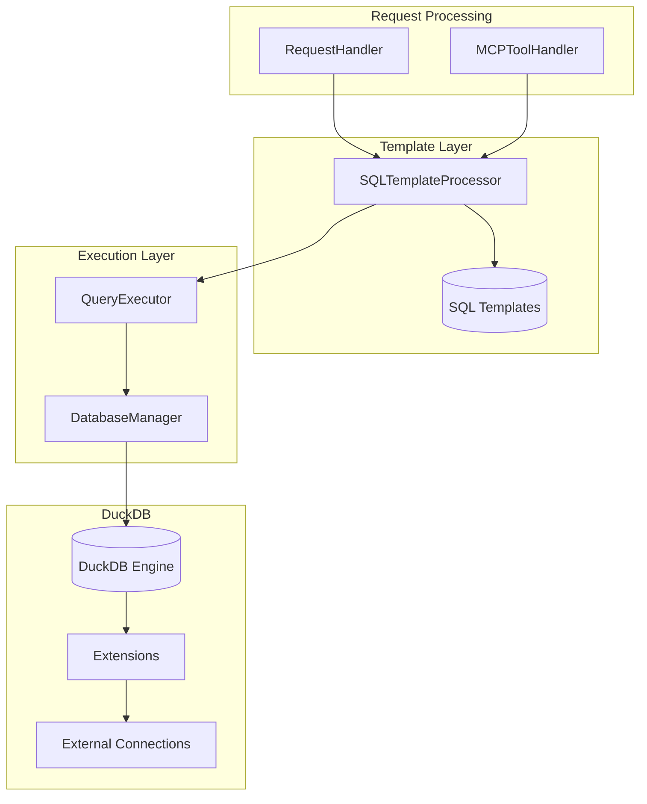
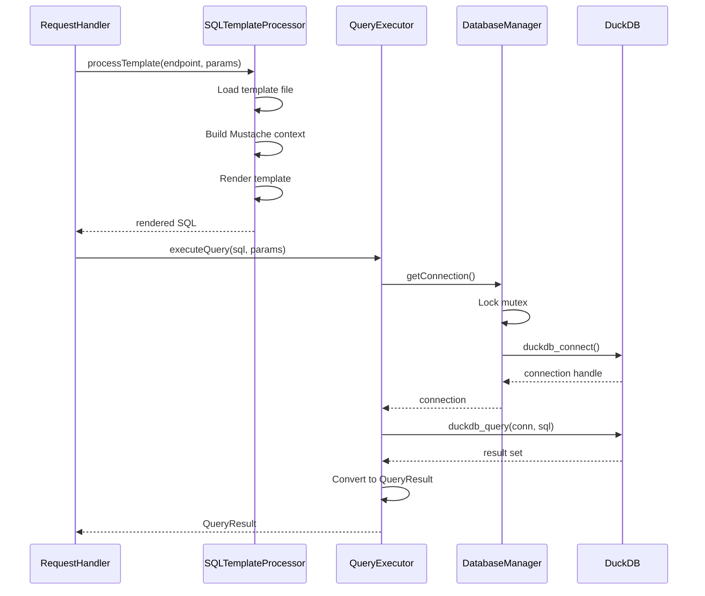

# Query Execution

This document describes the SQL template processing and query execution architecture in flAPI.

## Overview

Query execution involves:
1. Loading SQL templates from disk
2. Expanding Mustache templates with request parameters
3. Executing queries on DuckDB
4. Formatting results for API responses

## Architecture



## SQLTemplateProcessor

`SQLTemplateProcessor` (src/sql_template_processor.cpp) handles Mustache template expansion.

### Template Context

Templates have access to these variables:

| Variable | Description | Example |
|----------|-------------|---------|
| `params.*` | Request parameters | `params.id`, `params.limit` |
| `conn.*` | Connection properties | `conn.path`, `conn.host` |
| `env.*` | Environment variables | `env.API_KEY` |
| `cache.*` | Cache metadata | `cache.table`, `cache.previousSnapshotTimestamp` |
| `auth.*` | Auth context | `auth.user`, `auth.roles` |

### Template Syntax

**Triple Braces (String Escaping):**
```sql
-- Escapes quotes for safe string interpolation
WHERE name = '{{{ params.name }}}'
-- Input: O'Brien → Output: 'O''Brien'
```

**Double Braces (Raw Output):**
```sql
-- No escaping, for numbers and identifiers
LIMIT {{ params.limit }}
-- Input: 100 → Output: 100
```

**Conditional Sections:**
```sql
{{#params.id}}
  -- Rendered if params.id exists and is truthy
  AND id = {{{ params.id }}}
{{/params.id}}

{{^params.id}}
  -- Rendered if params.id does NOT exist
  AND id IS NULL
{{/params.id}}
```

**Default Values:**
```sql
LIMIT {{#params.limit}}{{ params.limit }}{{/params.limit}}{{^params.limit}}100{{/params.limit}}
```

### Processing Flow

```cpp
std::string processTemplate(const EndpointConfig& endpoint,
                            std::map<std::string, std::string>& params) {
    // 1. Load template file
    std::string template_content = loadTemplateFile(endpoint.templateSource);

    // 2. Build context
    auto context = buildContext(endpoint, params);

    // 3. Render Mustache template
    return mustache::render(template_content, context);
}
```

## QueryExecutor

`QueryExecutor` (src/query_executor.cpp) executes SQL against DuckDB.

### Query Methods

```cpp
// Execute read query with optional pagination
QueryResult executeQuery(const std::string& query,
                        const std::map<std::string, std::string>& params,
                        bool with_pagination = true);

// Execute query against cache tables (DuckLake)
QueryResult executeDuckLakeQuery(const std::string& query,
                                 const std::map<std::string, std::string>& params);

// Execute write operation
WriteResult executeWrite(const EndpointConfig& endpoint,
                        std::map<std::string, std::string>& params);
```

### QueryResult Structure

```cpp
struct QueryResult {
    std::vector<std::string> columns;
    std::vector<std::vector<std::string>> rows;
    int64_t total_rows;
    bool from_cache;

    crow::json::wvalue toJson() const;
};
```

### WriteResult Structure

```cpp
struct WriteResult {
    int64_t rows_affected = 0;
    std::optional<crow::json::wvalue> returned_data;  // For RETURNING clauses
    std::string last_insert_id;
};
```

## DatabaseManager

`DatabaseManager` (src/database_manager.cpp) is a singleton that manages DuckDB connections.

### Singleton Pattern

```cpp
class DatabaseManager : public std::enable_shared_from_this<DatabaseManager> {
public:
    static std::shared_ptr<DatabaseManager> getInstance();

    DatabaseManager(const DatabaseManager&) = delete;
    DatabaseManager& operator=(const DatabaseManager&) = delete;

private:
    duckdb_database db;
    std::mutex db_mutex;
};
```

### Initialization

```cpp
void initializeDBManagerFromConfig(std::shared_ptr<ConfigManager> config_manager) {
    // 1. Create DuckDB config
    createAndInitializeDuckDBConfig(config_manager, config);

    // 2. Open database (file or in-memory)
    duckdb_open_ext(db_path.c_str(), &db, config, nullptr);

    // 3. Load default extensions
    loadDefaultExtensions(config_manager);

    // 4. Initialize connections
    initializeConnections(config_manager);
}
```

### Connection Initialization

For each connection in `flapi.yaml`, DatabaseManager executes initialization SQL:

```yaml
connections:
  postgres-db:
    init: |
      INSTALL postgres;
      LOAD postgres;
      ATTACH 'host=localhost dbname=mydb' AS pg (TYPE postgres);
    properties:
      host: localhost
      database: mydb
```

### Thread Safety

All DuckDB operations are protected by a mutex:

```cpp
duckdb_connection getConnection() {
    std::lock_guard<std::mutex> lock(db_mutex);
    duckdb_connection conn;
    duckdb_connect(db, &conn);
    return conn;
}
```

## DuckDB Extensions

flAPI supports all DuckDB extensions. Common ones:

| Extension | Purpose | Auto-loads for |
|-----------|---------|---------------|
| `json` | JSON functions | `.json` files |
| `parquet` | Parquet files | `.parquet` files |
| `httpfs` | HTTP/S3/GCS access | `s3://`, `https://` |
| `postgres_scanner` | PostgreSQL | `ATTACH ... TYPE postgres` |
| `sqlite_scanner` | SQLite files | `sqlite_scan()` |
| `excel` | Excel files | `.xlsx` files |

Extensions are loaded on-demand or explicitly:

```yaml
duckdb:
  default_extensions:
    - json
    - httpfs
    - postgres
```

## Query Execution Flow



## Pagination

Read queries can include automatic pagination:

```cpp
QueryResult executeQuery(const std::string& query,
                        const std::map<std::string, std::string>& params,
                        bool with_pagination = true);
```

Pagination params:
- `_limit` - Maximum rows to return
- `_offset` - Rows to skip

## Write Operations

Write operations have additional features:

```yaml
operation:
  type: write
  transaction: true          # Wrap in BEGIN/COMMIT
  returns_data: true         # Expect RETURNING clause
  validate_before_write: true
```

```cpp
WriteResult executeWriteInTransaction(const EndpointConfig& endpoint,
                                      std::map<std::string, std::string>& params) {
    auto executor = createQueryExecutor();
    executor.beginTransaction();
    try {
        auto result = executeWrite(executor, endpoint, params);
        executor.commit();
        return result;
    } catch (...) {
        executor.rollback();
        throw;
    }
}
```

## Source Files

| File | Purpose |
|------|---------|
| `src/sql_template_processor.cpp` | Mustache template processing |
| `src/query_executor.cpp` | Query execution |
| `src/database_manager.cpp` | DuckDB connection management |
| `src/include/database_manager.hpp` | Struct definitions |

## Related Documentation

- [DESIGN_DECISIONS.md](../DESIGN_DECISIONS.md#1-singleton-pattern-for-databasemanager) - Why singleton
- [DESIGN_DECISIONS.md](../DESIGN_DECISIONS.md#4-mustache-for-sql-templates) - Why Mustache
- [caching.md](./caching.md) - Cache query execution
